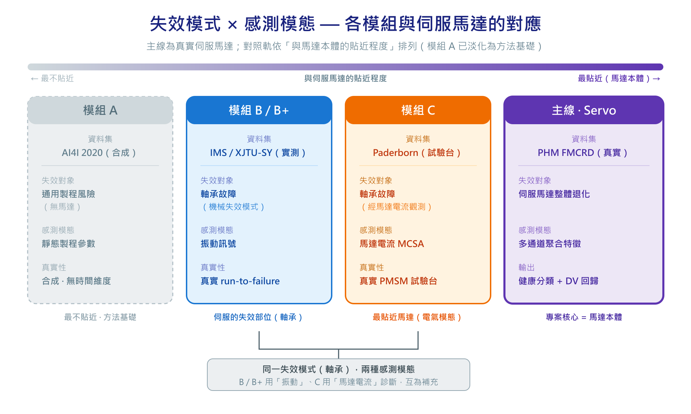
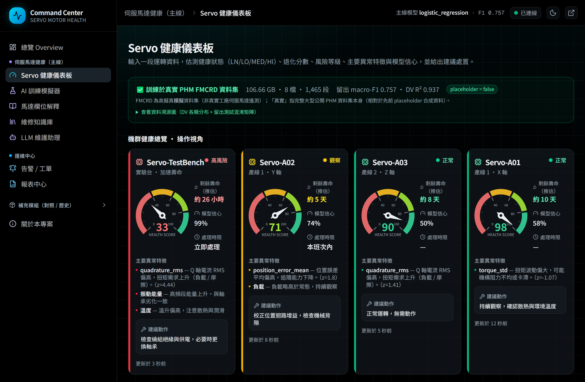
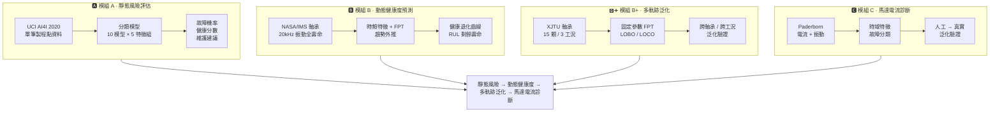

# AI 伺服馬達健康狀態估測與智慧維護助理系統

> **狀態（2026-06-27）**：主線 **模組 Servo**（PHM 伺服馬達滾珠螺桿退化資料，健康狀態估測 +
> 退化值回歸）已**導入完整真實 PHM FMCRD 資料集（106 GB）並重訓**（`placeholder=false`）：
> 串流聚合 8 檔 / ~4.4 億列 → 1,465 段特徵，**留出測試**（train 檔訓練、test 檔評估）分類
> macro-F1 **0.757**、DV 回歸 R² **0.937**；附可獨立重驗的**資料溯源**（CRC32 指紋 + 圖 +
> `GET /servo/provenance` + 儀表板面板）。誠實性：FMCRD 為高擬真**模擬**資料集（非真實工廠遙測）。
> 另含 AI 訓練模擬器 / 馬達欄位解釋 / LLM 維護助理（多供應商：Groq / OpenRouter / Gemini /
> Anthropic 依序，全失敗才用離線範本）/ 維修知識庫(RAG) / 深度學習離線 baseline。
> **Next.js 前端互動化**：B+ 延伸應用（E2 維護建議 / E3 串流回放 / LOBO-LOCO）、模組 C 即時推論、
> 模組 A 互動門檻調節器；儀表板→LLM 助理可帶入所選樣本。原 Model A/B/B+/C 保留為**對照與歷史補充**。
> 細節見 [`docs/MODULE_SERVO_PLAN.md`](docs/MODULE_SERVO_PLAN.md)、[`docs/DATA_PROVENANCE.md`](docs/DATA_PROVENANCE.md)。


[](https://ai-final-project-hs27lq6zl-chen-yu-s-project.vercel.app/)
[](https://aifinalproject-test.streamlit.app/)

<p align="center">
   C 馬達電流 > B/B+ 軸承 > A 合成方法基礎" width="860">
</p>

<p align="center">
  🚀 <strong>線上 Demo</strong>：
  <a href="https://ai-final-project-one.vercel.app/">Next.js Command Center（主前端）</a>
  ·
  <a href="https://aifinalproject-test.streamlit.app/">Streamlit（對照 / fallback）</a>
</p>

<p align="center">
  
  <br>
  <sub><em>Next.js Command Center — Servo 健康儀表板「機群健康總覽」：四台設備的指針儀表（健康分數 + RUL + 異常特徵 + 建議動作，深色模式示意）</em></sub>
</p>

> **專案定位**：端到端**預測性維護原型**，以**伺服馬達健康主線（模組 Servo · 真實 PHM FMCRD）** 為核心，
> 另含四條**對照軌**——依與伺服馬達的貼近程度為 **C（馬達電流 MCSA）> B / B+（IMS / XJTU 軸承）>
> A（AI4I 合成製程，最不貼近，僅方法基礎）**。對照軌補上電氣模態、機械失效模式與方法學基礎；模組 A 為
> 合成資料，定位為入門對照、非伺服結果的主要依據（見 [`outputs/figures/servo_modality_matrix.png`](outputs/figures/servo_modality_matrix.png)）。
>
> **本系統是**：以運轉條件估計故障風險與健康分數、以振動退化趨勢偵測退化起點並估計
> RUL，並依規則產生維護建議的決策輔助工具。
>
> **本系統不是**：即時馬達控制器、可跨工況泛化的精準 RUL 回歸器、或已在實際工廠長期
> 資料上驗證過的成熟系統。

---

## 目錄

1. [專案簡介與動機](#1-專案簡介與動機)
2. [CRISP-DM 流程對應](#2-crisp-dm-流程對應)
3. [資料集說明與限制](#3-資料集說明與限制)
4. [專案架構](#4-專案架構)
5. [安裝方式](#5-安裝方式)
6. [取得資料集](#6-取得資料集)
7. [執行 EDA](#7-執行-eda)
8. [訓練模型](#8-訓練模型)
9. [評估最佳模型](#9-評估最佳模型)
10. [單筆 CLI 預測](#10-單筆-cli-預測)
11. [啟動 Streamlit Dashboard](#11-啟動-streamlit-dashboard)
12. [啟動 FastAPI 服務](#12-啟動-fastapi-服務)
13. [輸出格式與維護建議規則](#13-輸出格式與維護建議規則)
14. [模型選擇邏輯](#14-模型選擇邏輯)
15. [特徵重要性](#15-特徵重要性)
16. [GCP VM 部署指引](#16-gcp-vm-部署指引)
17. [Docker 一鍵部署](#17-docker-一鍵部署)
18. [持續整合 CI](#18-持續整合-ci)
19. [專案限制與未來工作](#19-專案限制與未來工作)
20. [參考資料](#20-參考資料)

---

## 1. 專案簡介與動機

工業設備與伺服馬達長時間運轉時，會累積與**溫度**、**扭矩**、**刀具磨耗**、**機械
負載**相關的壓力。若能在故障真正發生前預先估計風險，運維單位即可：

- 降低非計畫性停機；
- 減少緊急維修費用；
- 避免製程中途故障所造成的物料報廢。

本專案建立一套**預測性維護原型**系統，定位為「維護決策輔助」工具：產出故障機率、
健康分數、人類可讀的維護建議，**不**對任何馬達下達控制命令。

### 四軌架構：模組 A / B / B+ / C

系統由四條**互補但獨立**的軌道組成，將專案從「靜態風險評估」延伸到「動態健康度預測」、
以多軌跡 / 多工況資料**驗證泛化邊界**，再以 Paderborn 馬達定子電流（MCSA）**補上電氣模態**：

> **定位提醒**：A/B/B+/C 皆為**對照軌**，輔助真實伺服馬達主線（模組 Servo）。依與伺服馬達的貼近程度為
> **C（馬達電流，最貼近馬達）> B / B+（軸承，伺服的機械失效模式）> A（合成通用 PdM，最不貼近，僅方法基礎）**。
> 下表保留 A→B→B+→C 的方法演進順序呈現；其中 A 為合成資料，已淡化為入門對照。



| 面向 | 🅰 模組 A · 靜態風險 | 🅱 模組 B · 動態健康度 | 🅱➕ 模組 B+ · 多軌跡泛化 | 🅲 模組 C · 馬達電流診斷 |
| --- | --- | --- | --- | --- |
| 資料集 | UCI **AI4I 2020**（合成） | NASA/**IMS 軸承 Set 2**（實測 run-to-failure）| **XJTU-SY**（實測，15 顆 / 3 工況）| **Paderborn**（實測試驗台，真實+人工損傷）|
| 資料型態 | 單筆**點資料**（製程工況快照） | **20 kHz 高頻振動**時間序列 | **25.6 kHz 振動** × 15 條軌跡 | **64 kHz 電流 + 振動**（多筆量測）|
| 感測量 | 溫度 / 扭矩 / 轉速 / 刀具磨耗 | 加速度振動（時域 + 頻域特徵） | 加速度振動（水平 / 垂直）| **馬達定子電流 (MCSA)** + 加速度振動 |
| 目標 | 故障 / 正常**二元分類** | **健康分數退化 + 剩餘壽命（RUL）** | **跨軸承 / 跨工況泛化驗證** | **故障分類**（健康/外環/內環）|
| 建模方法 | 監督式分類（10 模型 × 5 特徵組） | 健康指標 + FPT 偵測 + **指數趨勢外推** | 固定參數 FPT/外推 + **LOBO / LOCO** + 領域自適應(E1) | 監督式分類 + **人工→真實泛化** |
| 評估指標 | F1 / Recall / ROC-AUC / PR-AUC | RUL MAE / RMSE（小時）、退化提前量 | FPT 提前量、R²（LOBO / LOCO / 自適應）| macro-F1 / 混淆矩陣（baseline vs 真實）|
| 主要輸出 | 故障機率、健康分數、維護建議 | 退化曲線（100→0）、RUL、告警提前量 | 多軌跡健康疊圖、泛化結論、維護建議(E2)、串流回放(E3) | 故障類別、人工→真實泛化落差、混淆矩陣 |
| 時間維度 | 無（靜態快照） | 有（全壽命**動態**演進） | 有（15 條獨立軌跡）| 無（每筆量測獨立）|
| 對應頁面 | 單筆預測 / What-if / 批次 / 評估 | 健康度總覽 / RUL 預測 / 互動探索 | 多軌跡泛化 / B+ 延伸應用 | 馬達電流故障診斷 |
| 核心限制 | 合成資料、無 RUL 標籤 | 單一退化軌跡、突發失效 → RUL 偏粗 | 絕對 RUL 跨壽命尺度 / 工況受限（E1 部分改善）| 真實+人工混合、分類非 RUL、子集 MVP |

> 四軌**無法合併成同一個模型**（物理量、感測器、目標皆不同），因此在系統中以平行的獨立
> 軌道呈現。B+ 以多軌跡 / 多工況驗證「健康監測可泛化、絕對 RUL 受限」；C 以馬達電流補上電氣
> 模態並驗證「人工故障訓練能否泛化到真實損傷」。細節見
> [`docs/MODULE_B_RESULTS.md`](docs/MODULE_B_RESULTS.md)、
> [`docs/MODULE_B_PLUS_XJTU_PLAN.md`](docs/MODULE_B_PLUS_XJTU_PLAN.md) 與
> [`docs/MODULE_C_PADERBORN_PLAN.md`](docs/MODULE_C_PADERBORN_PLAN.md)。

---

## 2. CRISP-DM 流程對應

| 階段                        | 對應實作                                                                            |
| --------------------------- | ----------------------------------------------------------------------------------- |
| Business Understanding      | 本 README §1、§3、§16、`outputs/reports/REPORT_OUTLINE.md`                           |
| Data Understanding          | `src/data/load_data.py`、`scripts/run_eda.py`、`notebooks/01_eda.ipynb`              |
| Data Preparation            | `src/data/preprocess.py`、`src/features/feature_engineering.py`                     |
| Modeling                    | `src/models/model_registry.py`、`src/models/train.py`                               |
| Evaluation                  | `src/models/evaluate.py`、`outputs/metrics/`、`outputs/figures/`                    |
| Deployment / Application    | `web/`（Next.js 主前端）、`app/backend/`（FastAPI）、`app/streamlit_app.py`（fallback）、`deploy/`、`docs/DEPLOYMENT.md` |

---

## 3. 資料集說明與限制

本專案使用 **UCI AI4I 2020 Predictive Maintenance Dataset**（`ai4i2020.csv`，10,000 筆，故障比例約 3.4%）。

| 分組         | 欄位                                                                                                                  |
| ------------ | --------------------------------------------------------------------------------------------------------------------- |
| ID（捨棄）   | `UDI`、`Product ID`                                                                                                   |
| 特徵         | `Type`、`Air temperature [K]`、`Process temperature [K]`、`Rotational speed [rpm]`、`Torque [Nm]`、`Tool wear [min]`   |
| 主要目標     | `Machine failure`                                                                                                     |
| 故障類型標籤 | `TWF`、`HDF`、`PWF`、`OSF`、`RNF`（**禁止**作為 X 使用）                                                              |

### 必讀注意事項

1. **AI4I 2020 是合成資料集。** 由參數化製程模型產生，**不是**任何實際伺服馬達的長期紀錄。
2. **不含 RUL（剩餘壽命）標籤。** 因此本專案**不**宣稱能精準預測剩餘壽命，僅在「目前
   運轉條件」下估計故障風險。
3. **`TWF / HDF / PWF / OSF / RNF` 會洩漏目標。** 它們是 `Machine failure` 的確定性
   成因，必須從 X 中移除，否則就是 data leakage。專案中保留它們做為「第二階段故障
   類型分析」之用（見報告大綱）。
4. **類別不平衡。** 只看 Accuracy 會被誤導，本專案同時報告 Recall、F1、ROC-AUC、PR-AUC，
   並以 F1 作為最佳模型挑選依據（可在 `config.yaml` 調整）。

### 模組 B / B+ 資料集（動態健康度軌）

| 模組 | 資料集 | 內容 | 用途 |
| --- | --- | --- | --- |
| B | NASA / **IMS** Bearing Set 2 | 20 kHz 振動 run-to-failure（單一軸承軌跡）| 健康指標 / FPT / 趨勢外推 RUL |
| B+ | **XJTU-SY** | 25.6 kHz 振動，15 顆 / 3 工況 run-to-failure | 跨軸承、跨工況泛化驗證 |

兩者皆為**實測軸承退化資料**（非伺服馬達本體；本專案以「旋轉機械 / 電動機」為方法範疇、
以伺服馬達為應用情境），原始資料不進 git、需自行下載。評估與取捨見
[`docs/DATASET_EVALUATION.md`](docs/DATASET_EVALUATION.md)，流程與結果見
[`docs/MODULE_B_RESULTS.md`](docs/MODULE_B_RESULTS.md)。

---

## 4. 專案架構

> **狀態（2026-06-26）**：新增 **Next.js 前端 `web/`**（AI Servo Motor Health Command Center，
> 主要展示 UI）與 **`deploy/`**（nginx + systemd 部署範本）。後端 `app/backend/` 已擴充 Servo 主線、
> 機群（`/servo/fleet`）、告警/工單（`/servo/alerts`、`/servo/work_orders`）、知識庫與 LLM 助理端點。

```
project-root/
├── README.md
├── requirements.txt
├── .gitignore
├── .dockerignore
├── Dockerfile
├── docker-compose.yml
├── .github/
│   └── workflows/
│       └── ci.yml
├── config.yaml
├── data/
│   ├── README.md
│   ├── raw/                 <-- ai4i2020.csv；模組 B/B+ 為 raw/ims、raw/xjtu（不進 git）
│   └── processed/
├── docs/                    # 模組規劃 / 結果 / 資料評估 / 網頁改版 / 部署
│   ├── MODULE_SERVO_PLAN.md         # Servo 主線
│   ├── MODULE_B_IMS_PLAN.md
│   ├── MODULE_B_DL_PLAN.md
│   ├── MODULE_B_RESULTS.md
│   ├── MODULE_B_PLUS_XJTU_PLAN.md
│   ├── MODULE_C_PADERBORN_PLAN.md
│   ├── DATASET_EVALUATION.md
│   ├── WEB_REVAMP_PLAN.md           # 前端改版（Streamlit → Next.js）
│   └── DEPLOYMENT.md                # GCP VM + nginx 部署 runbook
├── notebooks/
│   └── 01_eda.ipynb
├── scripts/
│   └── run_eda.py
├── src/
│   ├── data/
│   │   ├── load_data.py
│   │   ├── preprocess.py
│   │   ├── load_ims.py            # 模組 B：IMS 載入
│   │   ├── build_ims_dataset.py
│   │   ├── load_xjtu.py           # 模組 B+：XJTU 載入
│   │   └── build_xjtu_dataset.py
│   ├── features/
│   │   ├── feature_engineering.py
│   │   ├── feature_selection.py
│   │   └── vibration_features.py  # 模組 B/B+：振動時頻特徵
│   ├── models/
│   │   ├── model_registry.py
│   │   ├── train.py
│   │   ├── train_failure_types.py
│   │   ├── tune.py
│   │   ├── evaluate.py
│   │   ├── explain.py
│   │   ├── model_card.py
│   │   ├── predict.py
│   │   ├── rul_extrapolation.py        # 模組 B：趨勢外推 RUL
│   │   ├── train_rul.py                # 模組 B：監督式對照（已知失敗）
│   │   ├── eval_xjtu_generalization.py # 模組 B+：跨軸承 / 工況泛化
│   │   ├── train_rul_lobo.py           # 模組 B+：LOBO 監督式
│   │   └── train_rul_loco.py           # 模組 B+：LOCO 監督式
│   ├── visualization/
│   │   └── plots.py
│   ├── ui/
│   │   ├── charts.py              # 含模組 B / B+ 圖表
│   │   └── style.py
│   └── utils/
│       └── paths.py
├── outputs/
│   ├── figures/             # EDA 與評估圖表
│   ├── metrics/             # model_comparison.csv、特徵重要性、test_predictions、tuning_history
│   ├── models/              # best_model.joblib、failure_type_model.joblib、MODEL_CARD.md
│   └── reports/REPORT_OUTLINE.md
├── app/
│   ├── streamlit_app.py     # Streamlit UI（fallback / 對照）
│   └── backend/             # FastAPI：模組 A/B/B+/C + Servo 主線 + 機群/告警 + 知識庫/LLM
│       ├── main.py
│       ├── schemas.py
│       └── services.py
├── web/                     # Next.js 前端（AI Servo Motor Health Command Center，主要 UI）
│   ├── src/app/             # Overview / servo/* / equipment/[id] / alerts / reports / module-*
│   ├── src/components/      # dashboard/* + ui/* (shadcn) + sidebar / header
│   ├── src/lib/             # api.ts（型別化 client）/ fleet.ts / ops.ts / mock.ts / servo.ts
│   └── README.md
├── deploy/                  # 部署範本（見 docs/DEPLOYMENT.md）
│   ├── nginx/servo-command-center.conf
│   └── systemd/servo-{backend,frontend}.service
└── tests/
    ├── test_preprocess.py
    ├── test_features.py
    ├── test_predict.py
    ├── test_backend_api.py        # API 端點測試（含 servo fleet/alerts/work_orders）
    └── test_servo_*.py
```

---

## 5. 安裝方式

> 已在 Python 3.10–3.14（Windows）測試通過。

```bash
# 1. 取得專案
git clone <your-repo-url>
cd FinalProject

# 2. 建立虛擬環境（擇一）
python -m venv .venv
# Windows PowerShell
.venv\Scripts\Activate.ps1
# macOS / Linux
source .venv/bin/activate

# 3. 安裝套件
pip install -r requirements.txt
```

`xgboost` 與 `lightgbm` 屬於選用套件。若您的環境安裝失敗，可從 `requirements.txt`
中註解掉，訓練流程會自動略過。

---

## 6. 取得資料集

從 UCI 下載 `ai4i2020.csv` 並放置於：

```
data/raw/ai4i2020.csv
```

詳細連結請見 `data/README.md`。

> 模組 B（IMS）/ B+（XJTU）的軸承資料下載與放置方式，見
> [`docs/MODULE_B_PLUS_XJTU_PLAN.md`](docs/MODULE_B_PLUS_XJTU_PLAN.md) 與
> [`docs/DATASET_EVALUATION.md`](docs/DATASET_EVALUATION.md)；原始資料不進 git，
> 放於 `data/raw/ims/`、`data/raw/xjtu/`。

---

## 7. 執行 EDA

```bash
# 命令列文字摘要
python -m src.data.load_data

# 完整 EDA：將圖表輸出到 outputs/figures/
python scripts/run_eda.py

# 或開啟互動式 notebook
jupyter notebook notebooks/01_eda.ipynb
```

產出圖表：
`eda_target_distribution.png`、`eda_type_distribution.png`、`eda_failure_types.png`、
`eda_numeric_distributions.png`、`eda_correlation.png`。

---

## 8. 訓練模型

```bash
python -m src.models.train
```

執行完整的**模型 × 特徵組合**比較，並儲存：

- `outputs/metrics/model_comparison.csv` — 跨模型 × 特徵組合比較表
- `outputs/models/best_model.joblib` — 最佳模型（含完整 Pipeline）
- `outputs/models/best_model_meta.json` — 給 UI / API 使用的中繼資料
- `outputs/figures/compare_*.png`、`feature_count_vs_*.png` — 比較圖表

特徵組合（定義於 `config.yaml::feature_sets`）：

| 名稱                 | 內容                                                  |
| -------------------- | ----------------------------------------------------- |
| A_baseline           | 原始 5 個數值欄位 + Type                              |
| B_engineered         | 原始 + 5 個工程特徵                                   |
| C_selectkbest_top8   | SelectKBest（ANOVA F-test）取前 8                     |
| D_rfe_top8           | RFE（以 Logistic Regression 為 base）取前 8           |
| E_rf_importance_top8 | Random Forest 重要性取前 8                            |

比較模型：Logistic Regression（baseline）、Decision Tree、Random Forest、SVM (RBF)、
Gradient Boosting、KNN、MLP、Naive Bayes，並在有安裝時加入 XGBoost 與 LightGBM。

---

## 9. 評估最佳模型

```bash
python -m src.models.evaluate
```

產出混淆矩陣、ROC 曲線、PR 曲線、原生特徵重要性（若模型有提供），以及在測試集上的
permutation importance。輸出位置：`outputs/figures/` 與 `outputs/metrics/best_model_eval.json`。

執行 evaluate 時會**自動重新產生** `outputs/models/MODEL_CARD.md`（模型卡），
讓文件與實際部署的模型保持一致。

### 第二階段：故障類型分類器

```bash
python -m src.models.train_failure_types
```

對每個故障類型（TWF / HDF / PWF / OSF / RNF）分別訓練一個 RandomForest，
輸出至 `outputs/models/failure_type_model.joblib` 與
`outputs/metrics/failure_type_comparison.csv`。

### 超參數調整（Optuna）

```bash
python -m src.models.tune
```

對 `model_comparison.csv` 中**前 3 名模型**跑 Optuna（預設 15 trials × 3-fold CV，
可在 `config.yaml::tuning` 調整）。若調參後的 F1 勝過原始最佳，會自動更新
`best_model.joblib`，並把原始版本備份到 `best_model_pretuned.joblib`。所有
trial 紀錄寫入 `outputs/metrics/tuning_history.csv`，每個模型的最佳參數寫入
`outputs/models/tuned_params.json`。

> 重要：調參**不保證**會勝過預設值。當 CV 與測試集排名不一致時，系統會
> 誠實地保留原始最佳模型並把這個結果寫進 `MODEL_CARD.md` 的調參摘要。

---

## 10. 單筆 CLI 預測

```bash
python -m src.models.predict
```

以內建範例資料跑一次完整推論並印出結果（故障機率、預測類別、健康分數、風險等級、
維護建議）。

---

## 11. 啟動 UI（Next.js 主前端 / Streamlit fallback）

> **狀態（2026-06-29）**：主要展示 UI 為 **Next.js 前端「AI Servo Motor Health Command Center」**
> （`web/`，**首頁為 Command Center 戰情室**、**亮/暗色可切換**、以 Servo 為主線、A/B/B+/C 收於 Legacy）。Streamlit 保留為 fallback 與對照。
> 前端啟動見 [`web/README.md`](web/README.md) 與 §16E；本機：
> `cd web && NEXT_PUBLIC_API_BASE_URL=http://localhost:8000 npm run dev`（→ `http://localhost:3000`）。

Streamlit（fallback）：

```bash
streamlit run app/streamlit_app.py
```

兩個 UI 共用同一組 FastAPI 端點。頁面（依模組分組，含首頁總覽）：

**🏠 入口**
- **首頁總覽** — Next.js 前端為 **Command Center 戰情室**（全廠狀態 / 立即處理 / 產線地圖 / 操作導向設備卡 + 指針儀表 / 工單佇列 / AI 維護摘要）；Streamlit 為以 Servo 為核心的一頁式導覽 + 補充模組（A/B/B+/C）入口磚。

**🛰 模組 Servo · 伺服馬達健康（主線）**
- **Servo 健康儀表板** — 健康狀態（LN/LO/MED/HI）、退化分數、風險、主要異常特徵、模型信心、建議處置；分類器狀態與退化值風險明顯矛盾時顯示一致性警告。
- **AI 訓練模擬器** — 選資料量 / 特徵組 / 演算法，小模型 vs Reference Model 對照 + 文字解釋；含深度學習離線結果（唯讀）。
- **馬達欄位解釋** — 欄位中文說明、異常意義、特徵組組成。
- **LLM 維護助理** — 由模型結構化輸出生成維修報告（含工單草稿），維修問答則針對單一提問簡答（兩者
  prompt 獨立、結果各自保留）；**多供應商**（Groq / OpenRouter / Gemini 免費模型 / Anthropic 依序嘗試），
  全失敗自動退回離線範本。金鑰見下方 `.env` 設定。
- **維修知識庫** — 文件清單 + TF-IDF 關鍵字檢索（離線）。

### LLM 金鑰設定（`.env`，選用）

LLM 維護助理可離線運作（範本）；要使用真正的 LLM，把根目錄的 `.env.example` 複製成 `.env`，
填入**任一家**免費供應商金鑰即可（助理依序嘗試，全失敗才用範本）：

```bash
cp .env.example .env   # 然後編輯 .env 填入任一金鑰
```

| 供應商 | 環境變數 | 取得金鑰 |
| --- | --- | --- |
| Groq | `GROQ_API_KEY` | <https://console.groq.com/keys> |
| OpenRouter | `OPENROUTER_API_KEY` | <https://openrouter.ai/keys> |
| Gemini | `GEMINI_API_KEY` | <https://aistudio.google.com/apikey> |
| Anthropic（選用，非免費） | `ANTHROPIC_API_KEY` | <https://console.anthropic.com/settings/keys> |

`.env` 不會進 git；供應商順序與模型可在 `config.yaml::llm` 調整。設定後重啟 Streamlit 生效。

**🅰 模組 A · 靜態風險**
- **手動單筆預測** — 填入欄位即可看到機率 / 健康分數 / 風險 / 維護建議。
- **What-if 敏感度分析** — 拖動參數即時看風險變化，1D / 2D 風險地景。
- **批次 CSV 上傳** — 上傳含六個原始欄位的 CSV，下載預測結果。
- **模型評估結果** — 比較表 + 所有已儲存的圖表 + 互動式決策門檻。

**🅱 模組 B · 動態健康度（IMS）**
- **健康度總覽** — 健康曲線、FPT、可調告警門檻、時間軸回放。
- **RUL 預測** — 預測 vs 實際 RUL，與監督式失敗的方法學對照。
- **互動探索** — 切換健康指標即時重算 FPT；原始波形 + FFT 頻譜。

**🅱➕ 模組 B+ · 多軌跡泛化（XJTU）**
- **多軌跡泛化** — 15 顆 / 3 工況固定參數健康監測、健康指標疊圖、LOBO / LOCO 對照。
- **B+ 延伸應用**（三個 tab）：
  - **E1 跨工況自適應 RUL** — 在 LOCO 切分上消融壽命比例 / transductive z-score / CORAL
    三種目標未標註的領域自適應，把 R² −1.22 抬到 −0.92（oracle 上界 +0.15，診斷瓶頸為壽命尺度）。
  - **E2 維護建議決策層** — 以巡檢檢查點滑桿，把健康度 / FPT / RUL 轉成每顆軸承的
    風險等級（🟢🟡🔴）＋建議維護時間窗＋理由（決策支援，非控制）。
  - **E3 即時串流回放** — 選一顆軸承逐快照重播 HI / FPT / RUL（瀏覽器端動畫、play/速度/拉桿，離線資料重播）。

**🅲 模組 C · 馬達電流診斷（Paderborn）**
- **馬達電流故障診斷** — 以馬達定子電流（MCSA）+ 振動的時域特徵做故障分類（健康/外環/內環）；
  headline 為「健康+人工故障訓練、真實損傷測試」的人工→真實泛化對照（baseline vs 真實 macro-F1 + 兩張混淆矩陣）。

**ℹ️ 其他**
- **關於本專案** — 三軌定位、A / B / B+ 對照與免責聲明。

---

## 12. 啟動 FastAPI 服務

```bash
uvicorn app.backend.main:app --host 0.0.0.0 --port 8000
```

Swagger UI：`http://localhost:8000/docs`（完整端點清單）。常用端點：

| 路由              | Method | 說明                                                  |
| ----------------- | ------ | ----------------------------------------------------- |
| `/health`         | GET    | 服務存活狀態與模型載入狀態                            |
| `/model_info`     | GET    | 最佳模型名稱、特徵組合、特徵欄位、測試集指標          |
| `/predict`        | POST   | 模組 A 單筆預測（請求格式見 `PredictRequest`）        |
| `/predict/batch`  | POST   | 模組 A JSON 批次（What-if sweep）                     |
| `/batch_predict`  | POST   | 模組 A multipart CSV 上傳，回傳每列的預測             |
| `/metrics`        | GET    | 訓練時產生的完整比較表                                |
| `/ims/*`、`/xjtu/*`、`/paderborn/eval` | GET | 模組 B / B+ / C 結果（健康曲線、泛化、混淆矩陣）|
| `/servo/predict`  | POST   | **Servo 主線**健康狀態 + 退化值估測                   |
| `/servo/fleet`    | GET    | **機群**：合成設備識別 + 真模型在 demo 運轉段的健康輸出 |
| `/servo/alerts`、`/servo/work_orders` | GET | 由真機群衍生的告警 / 工單           |
| `/servo/simulate` | POST   | 瀏覽器端小模型即時訓練（訓練模擬器）                 |
| `/servo/assistant/*`、`/knowledge/*` | GET/POST | LLM 維護助理 / 知識庫檢索       |

> **狀態（2026-06-26）**：機群健康與告警由**真實參考模型**在代表性 demo 運轉段上即時計算
> （非真實 PHM 遙測）；設備識別、遙測趨勢、工單排程為示意。前端據此呈現並標示資料來源。

範例 curl：

```bash
curl -X POST http://localhost:8000/predict \
  -H "Content-Type: application/json" \
  -d '{
    "type": "L",
    "air_temperature_K": 298.1,
    "process_temperature_K": 308.6,
    "rotational_speed_rpm": 1551,
    "torque_Nm": 42.8,
    "tool_wear_min": 108
  }'
```

> **網頁改版規劃（2026-06-26）**：本服務將擴充為前端（Next.js）的穩定 API 後端，現有 9 個
> endpoint 之外尚需補約 19 個缺口。完整缺口表、四階段計畫與執行順序見
> [`docs/WEB_REVAMP_PLAN.md`](docs/WEB_REVAMP_PLAN.md)。

---

## 13. 輸出格式與維護建議規則

每筆預測回傳：

```json
{
  "failure_probability": 0.83,
  "predicted_class": 1,
  "health_score": 17.0,
  "risk_level": "High",
  "maintenance_advice": [
    "製程與環境溫差過大（…）：建議檢查散熱迴路與通風路徑。",
    "…"
  ]
}
```

- `health_score = round((1 - failure_probability) * 100, 2)`
- `risk_level` 等級門檻（見 `config.yaml::risk`）：
  - `< 0.3` → **Low**（低）
  - `0.3 ≤ p < 0.7` → **Medium**（中）
  - `≥ 0.7` → **High**（高）

維護建議採**規則式**，在 `src/models/predict.py::_maintenance_advice` 中：

| 觸發條件                                             | 建議行動                                       |
| ---------------------------------------------------- | ---------------------------------------------- |
| `temp_diff ≥ 12 K`                                   | 檢查散熱迴路與通風路徑                          |
| `Torque [Nm] ≥ 55`                                   | 檢查機械負載與主軸是否卡阻                      |
| `Tool wear [min] ≥ 200`                              | 安排換刀或預防性保養                            |
| `Rotational speed [rpm] ≤ 1300`                      | 確認驅動命令與阻抗扭矩                          |
| `failure_probability ≥ 0.7`                          | 立即通報維護，並評估是否停機檢查                |
| `0.3 ≤ failure_probability < 0.7`                    | 提高巡檢頻率，監看扭矩 / 溫度趨勢               |

所有門檻集中於 `config.yaml::advice_thresholds`，方便依場域調整。

> 上述建議皆為**維護決策輔助**，**不是**馬達控制命令。最終仍由維護工程師判斷。

---

## 14. 模型選擇邏輯

- **為什麼不只看 Accuracy？** 正樣本約 3%，模型只要全部猜「沒故障」就有 ~97% Accuracy
  但完全沒有實用價值。因此本專案以 Precision / **Recall** / F1 / ROC-AUC / **PR-AUC**
  共同評估，預設以 F1 挑選最佳模型（可於 `config.yaml::modeling.scoring_for_best`
  調整）。
- **Recall 與 Precision 的取捨。** 在預測性維護情境，漏報（false negative）成本
  通常高於誤報（false positive）；若取得實際成本模型後，可在 `predict.py` 中調整
  決策門檻使其更偏向 Recall。
- **不平衡處理。** 支援 `class_weight="balanced"` 的模型都已啟用該設定。
- **避免 data leakage。** 所有 scaling 與 encoding 都包在 `Pipeline` 內，僅在訓練
  折上 fit；五個故障類型欄位在訓練前即從 X 移除。

實際選出的最佳模型記錄於 `outputs/models/best_model_meta.json`。

---

## 15. 特徵重要性

對最佳模型計算兩種互補的特徵重要性：

1. **原生重要性** — 樹模型用 `feature_importances_`，線性模型用係數絕對值。
   檔案：`outputs/figures/feature_importance_native.png`
   ／ `outputs/metrics/feature_importance_native.csv`。
2. **Permutation Importance** — 模型無關，於測試集上以 F1 為目標計算。
   檔案：`outputs/figures/feature_importance_permutation.png`
   ／ `outputs/metrics/feature_importance_permutation.csv`。

> 特徵重要性 ≠ 因果關係。高重要性僅代表「該特徵在本資料集上對本模型有用」，
> 工程上的因果解釋仍需領域專家判斷。

---

## 16. GCP VM 部署指引

> **狀態（2026-06-26）**：**Next.js 前端 + FastAPI 後端**經 nginx 反向代理整合的完整部署
> 步驟（systemd 常駐 + certbot HTTPS）已獨立成 [`docs/DEPLOYMENT.md`](docs/DEPLOYMENT.md)，
> 並附 `deploy/nginx/`、`deploy/systemd/` 範本（`/`→Next.js:3000、`/api/`→uvicorn:8000）。
> 不想用 GCP 額度時的**免費路線（Vercel + Hugging Face Spaces）**見
> [`docs/DEPLOYMENT.md`](docs/DEPLOYMENT.md) §9（附 `deploy/huggingface/` Dockerfile）。
> 下方 §16 A–E 為較早的 FastAPI/Streamlit 單體部署說明，仍適用後端與 Streamlit fallback。

### A. 開立 VM

1. 建立小型 VM（例：`e2-medium`），作業系統 Ubuntu 22.04 LTS。
2. 在防火牆放行所需 port（FastAPI 用 `8000`、Streamlit 用 `8501`，若用 Nginx
   反向代理則放行 `80 / 443`）。
3. SSH 進入 VM。

### B. 安裝 Python、Clone 專案

```bash
sudo apt update
sudo apt install -y python3.10 python3.10-venv python3-pip git nginx
git clone <your-repo-url>
cd FinalProject
python3.10 -m venv .venv
source .venv/bin/activate
pip install -r requirements.txt
```

將 `ai4i2020.csv` 放到 VM 上（可用 `scp` 或從 Cloud Storage 下載），再執行一次
訓練：

```bash
python -m src.models.train
```

### C. 以 systemd + Nginx 運行 FastAPI

`/etc/systemd/system/pmapi.service`：

```ini
[Unit]
Description=Predictive Maintenance FastAPI
After=network.target

[Service]
User=ubuntu
WorkingDirectory=/home/ubuntu/FinalProject
ExecStart=/home/ubuntu/FinalProject/.venv/bin/uvicorn app.backend.main:app --host 127.0.0.1 --port 8000
Restart=always

[Install]
WantedBy=multi-user.target
```

```bash
sudo systemctl daemon-reload
sudo systemctl enable --now pmapi
```

`/etc/nginx/sites-available/pmapi`：

```nginx
server {
    listen 80;
    server_name your.domain.example;

    location / {
        proxy_pass http://127.0.0.1:8000;
        proxy_set_header Host $host;
        proxy_set_header X-Forwarded-For $proxy_add_x_forwarded_for;
        proxy_set_header X-Real-IP $remote_addr;
    }
}
```

```bash
sudo ln -s /etc/nginx/sites-available/pmapi /etc/nginx/sites-enabled/
sudo nginx -t && sudo systemctl reload nginx
```

測試：

```bash
curl http://<your-vm-ip>/health
curl -X POST http://<your-vm-ip>/predict -H "Content-Type: application/json" -d '{...}'
```

### D. 以 systemd 運行 Streamlit

systemd 設定大致同上，將 `ExecStart` 改為：

```ini
ExecStart=/home/ubuntu/FinalProject/.venv/bin/streamlit run \
    /home/ubuntu/FinalProject/app/streamlit_app.py \
    --server.port 8501 --server.address 0.0.0.0
```

在 GCP 防火牆放行 `8501`，或以 Nginx 反向代理。

### E. 前端 — Next.js Command Center

> **狀態（2026-06-29）**：已建立 `web/`（Next.js App Router + TypeScript + Tailwind v4 +
> shadcn）**亮/暗色可切換**的工業風前端 **AI Servo Motor Health Command Center**，**首頁為 Command Center
> 戰情室**、以 Servo 主線為主角、模組 A/B/B+/C 收於 Legacy。Servo 五頁接真 API；機群/告警/工單暫為 mock。詳見
> [`docs/WEB_REVAMP_PLAN.md`](docs/WEB_REVAMP_PLAN.md)。

本機開發：

```bash
cd web
npm install
# 指向本機 FastAPI（見 §12）
NEXT_PUBLIC_API_BASE_URL=http://localhost:8000 npm run dev   # → http://localhost:3000
```

部署（GCP VM + Nginx）：

1. `cd web && npm run build && npm run start`（Next.js node 程序，預設 port 3000）。
2. Nginx 將前端站台與 `/api/*` 反向代理到 `http://127.0.0.1:8000/`。
3. 設定 `NEXT_PUBLIC_API_BASE_URL` 為部署來源或 `/api`。

---

## 17. Docker 一鍵部署

專案內附 `Dockerfile` 與 `docker-compose.yml`，可在本機或任何安裝了
Docker Engine 的 VM 上一鍵啟動 FastAPI + Streamlit。

### 17.1 先決條件
- Docker Desktop（Windows/Mac）或 Docker Engine + Compose plugin（Linux）。
- `data/raw/ai4i2020.csv` 已下載放好（容器透過 bind mount 讀取，不會把資料烤進
  映像檔）。
- `outputs/models/best_model.joblib` 已產生（若還沒，可在容器內訓練，見 17.3）。

### 17.2 起動兩個服務

```bash
# 第一次會建立映像（約 3–5 分鐘），之後啟動為秒級
docker compose up -d

# 開啟服務
# - FastAPI    -> http://localhost:8000
# - Streamlit  -> http://localhost:8501
# - Swagger UI -> http://localhost:8000/docs

# 看 log
docker compose logs -f api
docker compose logs -f ui

# 停掉
docker compose down
```

`docker-compose.yml` 使用 YAML anchor (`x-app-base`) 讓 `api` 與 `ui` 共用同
一個映像與 volume 設定，避免重複；FastAPI 服務內附 `healthcheck`，會定期打
`/health` 確認模型有載入。

### 17.3 在容器內訓練 / 評估

`data/` 與 `outputs/` 都是 bind mount，所以容器內訓練的產物會直接落回主機檔
案系統：

```bash
# 跑完整訓練流程
docker compose run --rm api python -m src.models.train
docker compose run --rm api python -m src.models.evaluate
docker compose run --rm api python -m src.models.train_failure_types

# 也可以調參
docker compose run --rm api python -m src.models.tune
```

### 17.4 部署到 GCP VM（搭配 Docker）

把 §16 的 systemd + venv 流程替換成 Docker：

```bash
# 在 GCP VM 上
git clone <your-repo-url>
cd FinalProject

# 把資料集 scp 上 VM 或從 GCS 下載到 data/raw/ai4i2020.csv
gsutil cp gs://your-bucket/ai4i2020.csv data/raw/

# 訓練一次，產出 outputs/models/
docker compose run --rm api python -m src.models.train

# 啟動長駐服務
docker compose up -d
```

> 若要把 Nginx 反向代理放在前面，把 `docker-compose.yml` 的 ports 從
> `8000:8000` 改成 `127.0.0.1:8000:8000`，再由 host 端 Nginx 代理到 8000 即可。

## 18. 持續整合 CI

`.github/workflows/ci.yml` 在每次 push / PR 到 `main` 或 `master` 時自動：

1. **語法檢查** — `python -m compileall src app tests scripts`
2. **單元測試** — `pytest -v`（**119 通過 / 1 依環境跳過**；多用合成 fixture 或已提交產物，**不需要**原始大型資料集）
3. **Docker build smoke test** — 用 buildx 建出映像並執行 `python -c "import ..."` 驗證模組可載入

矩陣同時跑 **Python 3.11** 與 **3.12**。pip cache 由 `actions/setup-python` 提供，
Docker layer cache 由 GitHub Actions cache backend (`type=gha`) 提供。

### 18.1 把 badge 接到自己的 repo

README 開頭的 `OWNER/REPO` 改成自己的 GitHub 路徑後，CI badge 會自動顯示
最近一次 workflow 執行結果。

### 18.2 本機重現 CI

```bash
# Step 1: 編譯檢查
python -m compileall -q src app tests scripts

# Step 2: 測試
pytest -v

# Step 3: Docker build
docker build -t pmm-app:ci .
docker run --rm pmm-app:ci python -c "from src.models import predict, explain, train; print('imports OK')"
```

## 19. 專案限制與未來工作

> **狀態（2026-06-24）**：模組 B+ 延伸 E1 / E2 / E3 已完成；**模組 C（Paderborn 馬達電流診斷 MVP）已納入**（人工→真實泛化）；下方「未來工作」已據此更新。

### 限制
- AI4I 2020 為**合成資料**，絕對的指標數值無法直接外推到實際工廠。
- AI4I 無時間維度；run-to-failure 的動態健康度 / RUL 由模組 B（IMS）、B+（XJTU 多軌跡 /
  多工況）補上。誠實限制：監督式「絕對小時數 RUL」跨壽命尺度 / 工況泛化受限（domain shift）；
  延伸軌 **E1** 以壽命正規化 / transductive z-score / CORAL **部分改善**（LOCO R² −1.22 → −0.92、
  oracle 上界 +0.15）但**未解決**，能穩健泛化的仍是健康監測 / 退化起點偵測。
- 決策門檻預設為 0.5；實際部署時應依維護成本模型調整。
- 維護建議規則為靜態門檻；正式部署時應依機台、製程個別校準。模組 B+ 的維護建議（E2）為
  決策支援啟發式，成本參數為示意值，未對真實維護結果驗證。

### 已完成的延伸（模組 B+ / C）
- **E1 跨工況自適應 RUL**（B+）：在 LOCO 切分上消融三種目標未標註的領域自適應，把 R² 由 −1.22 抬到 −0.92。
- **E2 維護建議決策層**（B+）：健康度 / FPT / RUL → 風險等級 + 建議維護時間窗 + 理由（決策支援）。
- **E3 即時串流回放**（B+）：逐快照重播 HI / FPT / RUL 的「會動的監測台」（離線資料重播）。
- **模組 C · Paderborn 馬達電流診斷（MVP）**：馬達定子電流（MCSA）+ 振動的時域特徵故障分類；
  headline 為「健康+人工故障訓練、真實損傷測試」的人工→真實泛化。見
  [`docs/MODULE_C_PADERBORN_PLAN.md`](docs/MODULE_C_PADERBORN_PLAN.md)。

### 未來工作（已排序）

> **範圍更新（2026-06-29）**：CE2（MCSA 頻譜邊帶）、CE3（全 4 工況跨工況泛化）、模組 B（IMS）1D-CNN
> Autoencoder 深度對照 **已確定不做**，自待辦移除（理由見 [`docs/MODULE_C_PADERBORN_EXTENSIONS_PLAN.md`](docs/MODULE_C_PADERBORN_EXTENSIONS_PLAN.md)、
> [`docs/MODULE_B_DL_PLAN.md`](docs/MODULE_B_DL_PLAN.md)）。

- **模組 C 延伸**：CE1 領域自適應、CE4 即時預測 FastAPI 端點**已完成**。
- **（以下皆推遲）** 其餘公開資料集（FEMTO / Mendeley / PMSM）、更強的領域自適應 / 更多工況以
  突破跨工況絕對 RUL、ESP32 邊緣 IoT 實場接入、成本敏感門檻調整 /
  模型校準、MLOps（重訓 / 漂移 / 版本 / 審計）、規則式維護建議升級為 LLM 結構化敘述。

---

## 20. 參考資料

- UCI — AI4I 2020 Predictive Maintenance Dataset：
  <https://archive.ics.uci.edu/dataset/601/ai4i+2020+predictive+maintenance+dataset>
- scikit-learn 文件：<https://scikit-learn.org/stable/>
- FastAPI 文件：<https://fastapi.tiangolo.com/>
- Streamlit 文件：<https://docs.streamlit.io/>
- CRISP-DM 文獻：Chapman et al., *CRISP-DM 1.0*, 2000.
