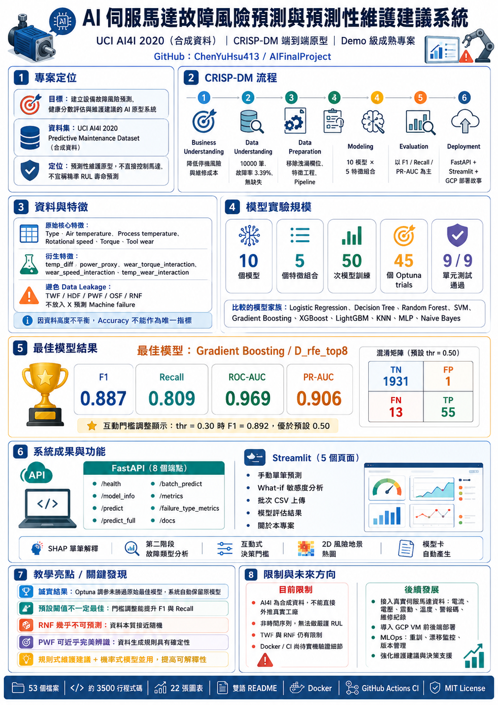
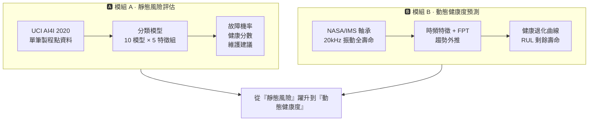

# AI 伺服馬達故障風險預測與預測性維護建議系統


[](https://aifinalproject-test.streamlit.app/)

<p align="center">
  
</p>

<p align="center">
  🚀 <strong>線上 Demo</strong>：<a href="https://aifinalproject-test.streamlit.app/">https://aifinalproject-test.streamlit.app/</a>
</p>

> **專案定位**：以 UCI **AI4I 2020** 合成資料集建立的端到端**預測性維護原型**。
>
> **本系統是**：以目前運轉條件估計故障風險、健康分數，並依規則產生維護建議
> 的決策輔助工具。
>
> **本系統不是**：即時馬達控制器、精準的剩餘壽命（RUL）回歸器、或已經在實際
> 工廠長期資料上驗證過的成熟系統。

---

## 目錄

1. [專案簡介與動機](#1-專案簡介與動機)
2. [CRISP-DM 流程對應](#2-crisp-dm-流程對應)
3. [資料集說明與限制](#3-資料集說明與限制)
4. [專案架構](#4-專案架構)
5. [安裝方式](#5-安裝方式)
6. [取得資料集](#6-取得資料集)
7. [執行 EDA](#7-執行-eda)
8. [訓練模型](#8-訓練模型)
9. [評估最佳模型](#9-評估最佳模型)
10. [單筆 CLI 預測](#10-單筆-cli-預測)
11. [啟動 Streamlit Dashboard](#11-啟動-streamlit-dashboard)
12. [啟動 FastAPI 服務](#12-啟動-fastapi-服務)
13. [輸出格式與維護建議規則](#13-輸出格式與維護建議規則)
14. [模型選擇邏輯](#14-模型選擇邏輯)
15. [特徵重要性](#15-特徵重要性)
16. [GCP VM 部署指引](#16-gcp-vm-部署指引)
17. [Docker 一鍵部署](#17-docker-一鍵部署)
18. [持續整合 CI](#18-持續整合-ci)
19. [專案限制與未來工作](#19-專案限制與未來工作)
20. [參考資料](#20-參考資料)

---

## 1. 專案簡介與動機

工業設備與伺服馬達長時間運轉時，會累積與**溫度**、**扭矩**、**刀具磨耗**、**機械
負載**相關的壓力。若能在故障真正發生前預先估計風險，運維單位即可：

- 降低非計畫性停機；
- 減少緊急維修費用；
- 避免製程中途故障所造成的物料報廢。

本專案建立一套**預測性維護原型**系統，定位為「維護決策輔助」工具：產出故障機率、
健康分數、人類可讀的維護建議，**不**對任何馬達下達控制命令。

### 雙模組架構：模組 A vs 模組 B

系統由兩個**互補但獨立**的模組組成，將專案從「靜態風險評估」延伸到「動態健康度預測」：



| 面向         | 🅰 模組 A · 靜態風險                          | 🅱 模組 B · 動態健康度                         |
| ------------ | -------------------------------------------- | --------------------------------------------- |
| 資料集       | UCI **AI4I 2020**（合成）                    | NASA/**IMS 軸承 Set 2**（實測 run-to-failure）|
| 資料型態     | 單筆**點資料**（製程工況快照）               | **20 kHz 高頻振動**時間序列                    |
| 感測量       | 溫度 / 扭矩 / 轉速 / 刀具磨耗                | 加速度振動（時域 + 頻域特徵）                  |
| 目標         | 故障 / 正常**二元分類**                      | **健康分數退化 + 剩餘壽命（RUL）**            |
| 建模方法     | 監督式分類（10 模型 × 5 特徵組）            | 健康指標 + FPT 偵測 + **指數趨勢外推**         |
| 評估指標     | F1 / Recall / ROC-AUC / PR-AUC               | RUL MAE / RMSE（小時）、退化提前量            |
| 主要輸出     | 故障機率、健康分數、維護建議                 | 退化曲線（100→0）、RUL、告警提前量            |
| 時間維度     | 無（靜態快照）                               | 有（全壽命**動態**演進）                       |
| 對應頁面     | 單筆預測 / What-if / 批次 / 評估             | 健康度總覽 / RUL 預測 / 互動探索               |
| 核心限制     | 合成資料、無 RUL 標籤                        | 單一退化軌跡、突發失效 → RUL 偏粗             |

> 兩模組**無法合併成同一個模型**（物理量、感測器、目標皆不同），因此在系統中以平行的
> 獨立軌道呈現。模組 B 細節見 [`docs/MODULE_B_IMS_PLAN.md`](docs/MODULE_B_IMS_PLAN.md)
> 與 [`docs/MODULE_B_RESULTS.md`](docs/MODULE_B_RESULTS.md)。

---

## 2. CRISP-DM 流程對應

| 階段                        | 對應實作                                                                            |
| --------------------------- | ----------------------------------------------------------------------------------- |
| Business Understanding      | 本 README §1、§3、§16、`outputs/reports/REPORT_OUTLINE.md`                           |
| Data Understanding          | `src/data/load_data.py`、`scripts/run_eda.py`、`notebooks/01_eda.ipynb`              |
| Data Preparation            | `src/data/preprocess.py`、`src/features/feature_engineering.py`                     |
| Modeling                    | `src/models/model_registry.py`、`src/models/train.py`                               |
| Evaluation                  | `src/models/evaluate.py`、`outputs/metrics/`、`outputs/figures/`                    |
| Deployment / Application    | `app/streamlit_app.py`、`app/backend/`                                              |

---

## 3. 資料集說明與限制

本專案使用 **UCI AI4I 2020 Predictive Maintenance Dataset**（`ai4i2020.csv`，10,000 筆，故障比例約 3.4%）。

| 分組         | 欄位                                                                                                                  |
| ------------ | --------------------------------------------------------------------------------------------------------------------- |
| ID（捨棄）   | `UDI`、`Product ID`                                                                                                   |
| 特徵         | `Type`、`Air temperature [K]`、`Process temperature [K]`、`Rotational speed [rpm]`、`Torque [Nm]`、`Tool wear [min]`   |
| 主要目標     | `Machine failure`                                                                                                     |
| 故障類型標籤 | `TWF`、`HDF`、`PWF`、`OSF`、`RNF`（**禁止**作為 X 使用）                                                              |

### 必讀注意事項

1. **AI4I 2020 是合成資料集。** 由參數化製程模型產生，**不是**任何實際伺服馬達的長期紀錄。
2. **不含 RUL（剩餘壽命）標籤。** 因此本專案**不**宣稱能精準預測剩餘壽命，僅在「目前
   運轉條件」下估計故障風險。
3. **`TWF / HDF / PWF / OSF / RNF` 會洩漏目標。** 它們是 `Machine failure` 的確定性
   成因，必須從 X 中移除，否則就是 data leakage。專案中保留它們做為「第二階段故障
   類型分析」之用（見報告大綱）。
4. **類別不平衡。** 只看 Accuracy 會被誤導，本專案同時報告 Recall、F1、ROC-AUC、PR-AUC，
   並以 F1 作為最佳模型挑選依據（可在 `config.yaml` 調整）。

---

## 4. 專案架構

```
project-root/
├── README.md
├── requirements.txt
├── .gitignore
├── .dockerignore
├── Dockerfile
├── docker-compose.yml
├── .github/
│   └── workflows/
│       └── ci.yml
├── config.yaml
├── data/
│   ├── README.md
│   ├── raw/                 <-- 將 ai4i2020.csv 放在這裡
│   └── processed/
├── notebooks/
│   └── 01_eda.ipynb
├── scripts/
│   └── run_eda.py
├── src/
│   ├── data/
│   │   ├── load_data.py
│   │   └── preprocess.py
│   ├── features/
│   │   ├── feature_engineering.py
│   │   └── feature_selection.py
│   ├── models/
│   │   ├── model_registry.py
│   │   ├── train.py
│   │   ├── train_failure_types.py
│   │   ├── tune.py
│   │   ├── evaluate.py
│   │   ├── explain.py
│   │   ├── model_card.py
│   │   └── predict.py
│   ├── visualization/
│   │   └── plots.py
│   └── utils/
│       └── paths.py
├── outputs/
│   ├── figures/             # EDA 與評估圖表
│   ├── metrics/             # model_comparison.csv、特徵重要性、test_predictions、tuning_history
│   ├── models/              # best_model.joblib、failure_type_model.joblib、MODEL_CARD.md
│   └── reports/REPORT_OUTLINE.md
├── app/
│   ├── streamlit_app.py
│   └── backend/
│       ├── main.py
│       ├── schemas.py
│       └── services.py
└── tests/
    ├── test_preprocess.py
    ├── test_features.py
    └── test_predict.py
```

---

## 5. 安裝方式

> 已在 Python 3.10–3.14（Windows）測試通過。

```bash
# 1. 取得專案
git clone <your-repo-url>
cd FinalProject

# 2. 建立虛擬環境（擇一）
python -m venv .venv
# Windows PowerShell
.venv\Scripts\Activate.ps1
# macOS / Linux
source .venv/bin/activate

# 3. 安裝套件
pip install -r requirements.txt
```

`xgboost` 與 `lightgbm` 屬於選用套件。若您的環境安裝失敗，可從 `requirements.txt`
中註解掉，訓練流程會自動略過。

---

## 6. 取得資料集

從 UCI 下載 `ai4i2020.csv` 並放置於：

```
data/raw/ai4i2020.csv
```

詳細連結請見 `data/README.md`。

---

## 7. 執行 EDA

```bash
# 命令列文字摘要
python -m src.data.load_data

# 完整 EDA：將圖表輸出到 outputs/figures/
python scripts/run_eda.py

# 或開啟互動式 notebook
jupyter notebook notebooks/01_eda.ipynb
```

產出圖表：
`eda_target_distribution.png`、`eda_type_distribution.png`、`eda_failure_types.png`、
`eda_numeric_distributions.png`、`eda_correlation.png`。

---

## 8. 訓練模型

```bash
python -m src.models.train
```

執行完整的**模型 × 特徵組合**比較，並儲存：

- `outputs/metrics/model_comparison.csv` — 跨模型 × 特徵組合比較表
- `outputs/models/best_model.joblib` — 最佳模型（含完整 Pipeline）
- `outputs/models/best_model_meta.json` — 給 UI / API 使用的中繼資料
- `outputs/figures/compare_*.png`、`feature_count_vs_*.png` — 比較圖表

特徵組合（定義於 `config.yaml::feature_sets`）：

| 名稱                 | 內容                                                  |
| -------------------- | ----------------------------------------------------- |
| A_baseline           | 原始 5 個數值欄位 + Type                              |
| B_engineered         | 原始 + 5 個工程特徵                                   |
| C_selectkbest_top8   | SelectKBest（ANOVA F-test）取前 8                     |
| D_rfe_top8           | RFE（以 Logistic Regression 為 base）取前 8           |
| E_rf_importance_top8 | Random Forest 重要性取前 8                            |

比較模型：Logistic Regression（baseline）、Decision Tree、Random Forest、SVM (RBF)、
Gradient Boosting、KNN、MLP、Naive Bayes，並在有安裝時加入 XGBoost 與 LightGBM。

---

## 9. 評估最佳模型

```bash
python -m src.models.evaluate
```

產出混淆矩陣、ROC 曲線、PR 曲線、原生特徵重要性（若模型有提供），以及在測試集上的
permutation importance。輸出位置：`outputs/figures/` 與 `outputs/metrics/best_model_eval.json`。

執行 evaluate 時會**自動重新產生** `outputs/models/MODEL_CARD.md`（模型卡），
讓文件與實際部署的模型保持一致。

### 第二階段：故障類型分類器

```bash
python -m src.models.train_failure_types
```

對每個故障類型（TWF / HDF / PWF / OSF / RNF）分別訓練一個 RandomForest，
輸出至 `outputs/models/failure_type_model.joblib` 與
`outputs/metrics/failure_type_comparison.csv`。

### 超參數調整（Optuna）

```bash
python -m src.models.tune
```

對 `model_comparison.csv` 中**前 3 名模型**跑 Optuna（預設 15 trials × 3-fold CV，
可在 `config.yaml::tuning` 調整）。若調參後的 F1 勝過原始最佳，會自動更新
`best_model.joblib`，並把原始版本備份到 `best_model_pretuned.joblib`。所有
trial 紀錄寫入 `outputs/metrics/tuning_history.csv`，每個模型的最佳參數寫入
`outputs/models/tuned_params.json`。

> 重要：調參**不保證**會勝過預設值。當 CV 與測試集排名不一致時，系統會
> 誠實地保留原始最佳模型並把這個結果寫進 `MODEL_CARD.md` 的調參摘要。

---

## 10. 單筆 CLI 預測

```bash
python -m src.models.predict
```

以內建範例資料跑一次完整推論並印出結果（故障機率、預測類別、健康分數、風險等級、
維護建議）。

---

## 11. 啟動 Streamlit Dashboard

```bash
streamlit run app/streamlit_app.py
```

頁面：
- **手動單筆預測** — 填入欄位即可看到機率 / 健康分數 / 風險 / 維護建議。
- **批次 CSV 上傳** — 上傳含六個原始欄位的 CSV，下載預測結果。
- **模型評估結果** — 比較表 + 所有已儲存的圖表。
- **關於本專案** — 系統定位與免責聲明。

---

## 12. 啟動 FastAPI 服務

```bash
uvicorn app.backend.main:app --host 0.0.0.0 --port 8000
```

Swagger UI：`http://localhost:8000/docs`

| 路由              | Method | 說明                                                  |
| ----------------- | ------ | ----------------------------------------------------- |
| `/health`         | GET    | 服務存活狀態與模型載入狀態                            |
| `/model_info`     | GET    | 最佳模型名稱、特徵組合、特徵欄位、測試集指標          |
| `/predict`        | POST   | 單筆預測（請求格式見 `PredictRequest`）               |
| `/batch_predict`  | POST   | multipart CSV 上傳，回傳每列的預測                    |
| `/metrics`        | GET    | 訓練時產生的完整比較表                                |

範例 curl：

```bash
curl -X POST http://localhost:8000/predict \
  -H "Content-Type: application/json" \
  -d '{
    "type": "L",
    "air_temperature_K": 298.1,
    "process_temperature_K": 308.6,
    "rotational_speed_rpm": 1551,
    "torque_Nm": 42.8,
    "tool_wear_min": 108
  }'
```

---

## 13. 輸出格式與維護建議規則

每筆預測回傳：

```json
{
  "failure_probability": 0.83,
  "predicted_class": 1,
  "health_score": 17.0,
  "risk_level": "High",
  "maintenance_advice": [
    "製程與環境溫差過大（…）：建議檢查散熱迴路與通風路徑。",
    "…"
  ]
}
```

- `health_score = round((1 - failure_probability) * 100, 2)`
- `risk_level` 等級門檻（見 `config.yaml::risk`）：
  - `< 0.3` → **Low**（低）
  - `0.3 ≤ p < 0.7` → **Medium**（中）
  - `≥ 0.7` → **High**（高）

維護建議採**規則式**，在 `src/models/predict.py::_maintenance_advice` 中：

| 觸發條件                                             | 建議行動                                       |
| ---------------------------------------------------- | ---------------------------------------------- |
| `temp_diff ≥ 12 K`                                   | 檢查散熱迴路與通風路徑                          |
| `Torque [Nm] ≥ 55`                                   | 檢查機械負載與主軸是否卡阻                      |
| `Tool wear [min] ≥ 200`                              | 安排換刀或預防性保養                            |
| `Rotational speed [rpm] ≤ 1300`                      | 確認驅動命令與阻抗扭矩                          |
| `failure_probability ≥ 0.7`                          | 立即通報維護，並評估是否停機檢查                |
| `0.3 ≤ failure_probability < 0.7`                    | 提高巡檢頻率，監看扭矩 / 溫度趨勢               |

所有門檻集中於 `config.yaml::advice_thresholds`，方便依場域調整。

> 上述建議皆為**維護決策輔助**，**不是**馬達控制命令。最終仍由維護工程師判斷。

---

## 14. 模型選擇邏輯

- **為什麼不只看 Accuracy？** 正樣本約 3%，模型只要全部猜「沒故障」就有 ~97% Accuracy
  但完全沒有實用價值。因此本專案以 Precision / **Recall** / F1 / ROC-AUC / **PR-AUC**
  共同評估，預設以 F1 挑選最佳模型（可於 `config.yaml::modeling.scoring_for_best`
  調整）。
- **Recall 與 Precision 的取捨。** 在預測性維護情境，漏報（false negative）成本
  通常高於誤報（false positive）；若取得實際成本模型後，可在 `predict.py` 中調整
  決策門檻使其更偏向 Recall。
- **不平衡處理。** 支援 `class_weight="balanced"` 的模型都已啟用該設定。
- **避免 data leakage。** 所有 scaling 與 encoding 都包在 `Pipeline` 內，僅在訓練
  折上 fit；五個故障類型欄位在訓練前即從 X 移除。

實際選出的最佳模型記錄於 `outputs/models/best_model_meta.json`。

---

## 15. 特徵重要性

對最佳模型計算兩種互補的特徵重要性：

1. **原生重要性** — 樹模型用 `feature_importances_`，線性模型用係數絕對值。
   檔案：`outputs/figures/feature_importance_native.png`
   ／ `outputs/metrics/feature_importance_native.csv`。
2. **Permutation Importance** — 模型無關，於測試集上以 F1 為目標計算。
   檔案：`outputs/figures/feature_importance_permutation.png`
   ／ `outputs/metrics/feature_importance_permutation.csv`。

> 特徵重要性 ≠ 因果關係。高重要性僅代表「該特徵在本資料集上對本模型有用」，
> 工程上的因果解釋仍需領域專家判斷。

---

## 16. GCP VM 部署指引

### A. 開立 VM

1. 建立小型 VM（例：`e2-medium`），作業系統 Ubuntu 22.04 LTS。
2. 在防火牆放行所需 port（FastAPI 用 `8000`、Streamlit 用 `8501`，若用 Nginx
   反向代理則放行 `80 / 443`）。
3. SSH 進入 VM。

### B. 安裝 Python、Clone 專案

```bash
sudo apt update
sudo apt install -y python3.10 python3.10-venv python3-pip git nginx
git clone <your-repo-url>
cd FinalProject
python3.10 -m venv .venv
source .venv/bin/activate
pip install -r requirements.txt
```

將 `ai4i2020.csv` 放到 VM 上（可用 `scp` 或從 Cloud Storage 下載），再執行一次
訓練：

```bash
python -m src.models.train
```

### C. 以 systemd + Nginx 運行 FastAPI

`/etc/systemd/system/pmapi.service`：

```ini
[Unit]
Description=Predictive Maintenance FastAPI
After=network.target

[Service]
User=ubuntu
WorkingDirectory=/home/ubuntu/FinalProject
ExecStart=/home/ubuntu/FinalProject/.venv/bin/uvicorn app.backend.main:app --host 127.0.0.1 --port 8000
Restart=always

[Install]
WantedBy=multi-user.target
```

```bash
sudo systemctl daemon-reload
sudo systemctl enable --now pmapi
```

`/etc/nginx/sites-available/pmapi`：

```nginx
server {
    listen 80;
    server_name your.domain.example;

    location / {
        proxy_pass http://127.0.0.1:8000;
        proxy_set_header Host $host;
        proxy_set_header X-Forwarded-For $proxy_add_x_forwarded_for;
        proxy_set_header X-Real-IP $remote_addr;
    }
}
```

```bash
sudo ln -s /etc/nginx/sites-available/pmapi /etc/nginx/sites-enabled/
sudo nginx -t && sudo systemctl reload nginx
```

測試：

```bash
curl http://<your-vm-ip>/health
curl -X POST http://<your-vm-ip>/predict -H "Content-Type: application/json" -d '{...}'
```

### D. 以 systemd 運行 Streamlit

systemd 設定大致同上，將 `ExecStart` 改為：

```ini
ExecStart=/home/ubuntu/FinalProject/.venv/bin/streamlit run \
    /home/ubuntu/FinalProject/app/streamlit_app.py \
    --server.port 8501 --server.address 0.0.0.0
```

在 GCP 防火牆放行 `8501`，或以 Nginx 反向代理。

### E. 前端（選用）

若另外建立 React / Vue / Next.js 前端：

1. `npm run build` 產生 `dist/`（或 `out/`）。
2. 由 Nginx 提供靜態檔案。
3. 設定 `/api/*` 反向代理到 `http://127.0.0.1:8000/`。
4. 在前端設定 `VITE_API_BASE_URL`（或對應變數）為 `/api`。

---

## 17. Docker 一鍵部署

專案內附 `Dockerfile` 與 `docker-compose.yml`，可在本機或任何安裝了
Docker Engine 的 VM 上一鍵啟動 FastAPI + Streamlit。

### 17.1 先決條件
- Docker Desktop（Windows/Mac）或 Docker Engine + Compose plugin（Linux）。
- `data/raw/ai4i2020.csv` 已下載放好（容器透過 bind mount 讀取，不會把資料烤進
  映像檔）。
- `outputs/models/best_model.joblib` 已產生（若還沒，可在容器內訓練，見 17.3）。

### 17.2 起動兩個服務

```bash
# 第一次會建立映像（約 3–5 分鐘），之後啟動為秒級
docker compose up -d

# 開啟服務
# - FastAPI    -> http://localhost:8000
# - Streamlit  -> http://localhost:8501
# - Swagger UI -> http://localhost:8000/docs

# 看 log
docker compose logs -f api
docker compose logs -f ui

# 停掉
docker compose down
```

`docker-compose.yml` 使用 YAML anchor (`x-app-base`) 讓 `api` 與 `ui` 共用同
一個映像與 volume 設定，避免重複；FastAPI 服務內附 `healthcheck`，會定期打
`/health` 確認模型有載入。

### 17.3 在容器內訓練 / 評估

`data/` 與 `outputs/` 都是 bind mount，所以容器內訓練的產物會直接落回主機檔
案系統：

```bash
# 跑完整訓練流程
docker compose run --rm api python -m src.models.train
docker compose run --rm api python -m src.models.evaluate
docker compose run --rm api python -m src.models.train_failure_types

# 也可以調參
docker compose run --rm api python -m src.models.tune
```

### 17.4 部署到 GCP VM（搭配 Docker）

把 §16 的 systemd + venv 流程替換成 Docker：

```bash
# 在 GCP VM 上
git clone <your-repo-url>
cd FinalProject

# 把資料集 scp 上 VM 或從 GCS 下載到 data/raw/ai4i2020.csv
gsutil cp gs://your-bucket/ai4i2020.csv data/raw/

# 訓練一次，產出 outputs/models/
docker compose run --rm api python -m src.models.train

# 啟動長駐服務
docker compose up -d
```

> 若要把 Nginx 反向代理放在前面，把 `docker-compose.yml` 的 ports 從
> `8000:8000` 改成 `127.0.0.1:8000:8000`，再由 host 端 Nginx 代理到 8000 即可。

## 18. 持續整合 CI

`.github/workflows/ci.yml` 在每次 push / PR 到 `main` 或 `master` 時自動：

1. **語法檢查** — `python -m compileall src app tests scripts`
2. **單元測試** — `pytest -v`（9 個測試，均使用合成資料，**不需要** AI4I CSV）
3. **Docker build smoke test** — 用 buildx 建出映像並執行 `python -c "import ..."` 驗證模組可載入

矩陣同時跑 **Python 3.11** 與 **3.12**。pip cache 由 `actions/setup-python` 提供，
Docker layer cache 由 GitHub Actions cache backend (`type=gha`) 提供。

### 18.1 把 badge 接到自己的 repo

README 開頭的 `OWNER/REPO` 改成自己的 GitHub 路徑後，CI badge 會自動顯示
最近一次 workflow 執行結果。

### 18.2 本機重現 CI

```bash
# Step 1: 編譯檢查
python -m compileall -q src app tests scripts

# Step 2: 測試
pytest -v

# Step 3: Docker build
docker build -t pmm-app:ci .
docker run --rm pmm-app:ci python -c "from src.models import predict, explain, train; print('imports OK')"
```

## 19. 專案限制與未來工作

### 限制
- AI4I 2020 為**合成資料**，絕對的指標數值無法直接外推到實際工廠。
- 資料不含時間序列／run-to-failure 軌跡，因此無法做嚴謹的 RUL 預測。
- 決策門檻預設為 0.5；實際部署時應依維護成本模型調整。
- 維護建議規則為靜態門檻；正式部署時應依機台、製程個別校準。

### 未來工作
- 接入實際伺服馬達遙測資料：電流、電壓、震動、溫度、警報碼、維修紀錄等。
- 改以 survival analysis / RUL 模型處理 run-to-failure 資料。
- 成本敏感的決策門檻調整；模型校準分析。
- 加入 MLOps：定期重訓、特徵漂移監控、模型版本管理、預測審計紀錄。
- 將規則式維護建議升級為以 LLM 產生的結構化敘述。

---

## 20. 參考資料

- UCI — AI4I 2020 Predictive Maintenance Dataset：
  <https://archive.ics.uci.edu/dataset/601/ai4i+2020+predictive+maintenance+dataset>
- scikit-learn 文件：<https://scikit-learn.org/stable/>
- FastAPI 文件：<https://fastapi.tiangolo.com/>
- Streamlit 文件：<https://docs.streamlit.io/>
- CRISP-DM 文獻：Chapman et al., *CRISP-DM 1.0*, 2000.
