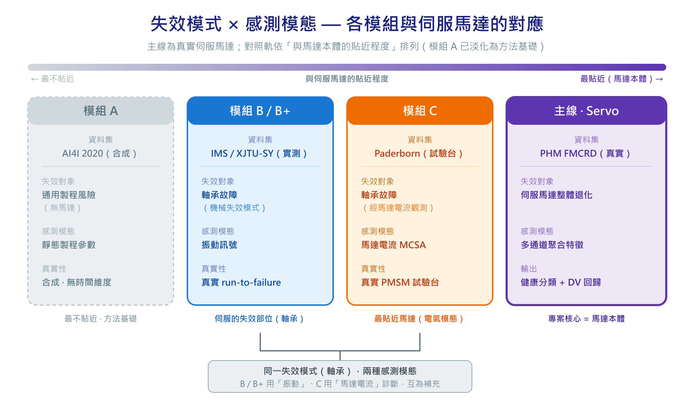

# AI 伺服馬達健康狀態估測與智慧維護助理系統

> **狀態（2026-07-08）**：主線 **模組 Servo**（真實 PHM FMCRD 資料集，健康分類 + 退化值回歸）已完整重訓
> （`placeholder=false`）：留出測試分類 macro-F1 **0.757**、DV 回歸 R² **0.937**，附可獨立重驗的資料溯源（CRC32 指紋 +
> `GET /servo/provenance`）。FMCRD 為高擬真**模擬**資料集（非真實工廠遙測）。另含四條對照軌（A/B/B+/C）、AI 訓練模擬器、
> LLM 維護助理、RAG 知識庫、即時監控 demo。主前端為 **Next.js Command Center**。


🚀 **線上 Demo**：[Next.js Command Center（主前端）](https://ai-final-project-one.vercel.app/) · [Streamlit（對照 / fallback）](https://aifinalproject-test.streamlit.app/)

<p align="center">
  
</p>

## 1. 專案簡介與定位

端到端**預測性維護原型**，以**真實 PHM 伺服馬達退化資料（模組 Servo）** 為主線，另含四條對照軌補上不同失效模式
與感測模態。定位為**維護決策輔助**：產出故障風險、健康分數與人類可讀的維護建議，**不**對馬達下達控制命令。

- **是**：以運轉條件估計故障風險 / 健康分數、以振動趨勢偵測退化起點並估 RUL、依規則產生維護建議的決策輔助工具。
- **不是**：即時馬達控制器、可跨工況泛化的精準 RUL 回歸器、或已在實廠長期資料上驗證的成熟系統。

### 四軌對照（依與伺服馬達的貼近程度）

| 模組 | 資料集 | 感測模態 | 目標 | 真實性 |
| --- | --- | --- | --- | --- |
| **Servo（主線）** | PHM FMCRD | 多通道聚合特徵 | 健康分類 + DV 回歸 | 高擬真模擬 |
| C（最貼近馬達） | Paderborn | 定子電流 MCSA + 振動 | 故障分類（人工→真實泛化） | 真實 PMSM 試驗台 |
| B / B+ | IMS / XJTU-SY | 振動 run-to-failure | 健康退化 + RUL / 多軌跡泛化 | 真實軸承退化 |
| A（僅方法基礎） | UCI AI4I 2020 | 靜態製程參數 | 故障二元分類 | 合成資料 |

> 誠實限制：A 為合成資料；IMS 為單軌跡不宣稱可泛化、不做深度 RUL 回歸；Paderborn 為故障分類（非 RUL）、屬試驗台
> 子集 MVP。細節見 [`docs/MODULE_SERVO_PLAN.md`](docs/MODULE_SERVO_PLAN.md)、[`docs/DATA_PROVENANCE.md`](docs/DATA_PROVENANCE.md)。

## 2. 專案架構

```
FinalProject/
├── config.yaml                  # 集中設定（路徑 / 特徵組 / 門檻 / LLM）
├── requirements{,-dev,-dl}.txt  # slim / 完整開發 / +torch
├── Dockerfile / docker-compose.yml / .github/workflows/ci.yml
├── data/raw/                    # ai4i2020.csv、ims/xjtu/paderborn/servo（不進 git）
├── src/                         # data / features / models / monitor / servo / llm / knowledge / ui / utils
├── app/                         # backend/main.py（FastAPI，全端點）+ streamlit_app.py（fallback）
├── web/                         # Next.js Command Center（主前端）
├── outputs/                     # figures / metrics / models / reports
├── docs/                        # 模組規劃 / 結果 / 資料溯源 / 部署 runbook
└── tests/                       # pytest（135 通過 / 1 依環境跳過）
```

CRISP-DM：Data → `src/data/`、`scripts/run_eda.py`；Modeling → `src/models/train.py`；Deployment → `web/`、`app/`、[`docs/DEPLOYMENT.md`](docs/DEPLOYMENT.md)。

## 3. 安裝

> 已在 Python 3.10–3.14（Windows）測試；CI 於 3.11 / 3.12 驗證。

```bash
git clone <your-repo-url> && cd FinalProject
python -m venv .venv
.venv\Scripts\Activate.ps1              # Windows（macOS/Linux: source .venv/bin/activate）
pip install -r requirements-dev.txt     # 完整環境（訓練 + FastAPI + 測試）
```

> 其他組合：雲端 / Streamlit 用 slim `requirements.txt`；離線深度學習用 `requirements-dl.txt`（多裝 torch）。`xgboost` /
> `lightgbm` 為選用，安裝失敗可註解掉會自動略過。**資料集**：AI4I 從 UCI 下載 `ai4i2020.csv` 放到 `data/raw/`；
> IMS / XJTU / Paderborn / Servo 原始資料不進 git，見 `data/README.md`。

## 4. 快速開始（模組 A 主流程）

```bash
python scripts/run_eda.py                    # EDA 圖表 → outputs/figures/
python -m src.models.train                   # 10 模型 × 5 特徵組比較 → best_model.joblib
python -m src.models.evaluate                # 混淆矩陣 / ROC / PR + 重生 MODEL_CARD.md
python -m src.models.train_failure_types     # 第二階段：故障類型分類器
python -m src.models.tune                    # Optuna 調參（前 3 名，15 trials × 3-fold）
python -m src.models.predict                 # 單筆 CLI 推論範例
```

5 個特徵組定義於 `config.yaml::feature_sets`（`A_baseline` / `B_engineered` / `C_selectkbest_top8` / `D_rfe_top8` / `E_rf_importance_top8`）；最佳模型以 F1 挑選。

## 5. 啟動服務

```bash
uvicorn app.backend.main:app --host 0.0.0.0 --port 8000       # FastAPI 後端（Swagger: /docs）
cd web && npm install && \
  NEXT_PUBLIC_API_BASE_URL=http://localhost:8000 npm run dev   # Next.js 主前端 → :3000
streamlit run app/streamlit_app.py                             # Streamlit fallback → :8501
```

前端涵蓋 Command Center 戰情室、Servo 五頁（儀表板 / 模擬器 / 欄位解釋 / LLM 助理 / 知識庫）、模組 A/B/B+/C 與即時監控雷達。

### 常用 API 端點（完整見 `/docs`）

| 路由 | Method | 說明 |
| --- | --- | --- |
| `/health`、`/model_info`、`/metrics` | GET | 存活狀態 / 最佳模型資訊 / 比較表 |
| `/predict`、`/predict/batch`、`/batch_predict` | POST | 模組 A 單筆 / What-if / CSV 批次 |
| `/ims/*`、`/xjtu/*`、`/paderborn/*` | GET/POST | 模組 B / B+ / C 結果 |
| `/monitor/scenarios`、`/monitor/stream` | GET | 即時監控回放 / SSE 串流 |
| `/servo/predict`、`/servo/fleet`、`/servo/provenance` | GET/POST | Servo 健康估測 / 機群 / 資料溯源 |
| `/servo/assistant/*`、`/knowledge/*` | GET/POST | LLM 維護助理 / 知識庫檢索 |

```bash
curl -X POST http://localhost:8000/predict -H "Content-Type: application/json" \
  -d '{"type":"L","air_temperature_K":298.1,"process_temperature_K":308.6,
       "rotational_speed_rpm":1551,"torque_Nm":42.8,"tool_wear_min":108}'
```

**LLM 金鑰（選用）**：助理可離線運作；要接真 LLM，複製 `.env.example` 為 `.env` 並填**任一家**金鑰（依序嘗試
`GROQ_API_KEY` → `OPENROUTER_API_KEY` → `GEMINI_API_KEY` → `ANTHROPIC_API_KEY`）。順序可於 `config.yaml::llm` 調整；`.env` 不進 git。

### 5.1 伺服馬達即時串流 demo（S1，FMCRD replay）

> **狀態（2026-07-10）**：S1 完成——真實 FMCRD replay 素材抽取 + SSE 發布端 + 視窗聚合接收端，
> 健康狀態隨 replay 段落 **LN → LO → HI** 演進（DV degradation_score 0.05→0.26→0.75、風險 Low→High）。
> 完整儀表板留待 S2；視窗 W/S 目前為占位預設，待 S1b 校準。

沿用即時監控的 SSE 骨架（`data: {json}` 串流），資料源換成**真實 FMCRD 測試資料**、模型接**參考模型 `predict_servo`**：

```bash
# 一次性：從 FMCRD zip 抽出 LN/LO/HI replay 素材到 data/demo/replay/（需原始 zip；無 zip 會清楚報錯）
python scripts/extract_replay_segments.py

# 終端 1：發布端（逐列以 RAW_COLUMNS schema 發布，預設加速重播 LN→LO→HI）
python scripts/servo_replay_publisher.py            # SSE：/servo/stream

# 終端 2：接收端（滑動視窗→複用 build_feature_table/aggregate_run 的 21 維 full 特徵→predict_servo→逐視窗打印）
python scripts/servo_replay_consumer.py
```

發布端另有 `--mode fake` 合成模式：**僅供管線連通性測試**，其資料**不在模型訓練分布內、預測輸出無效**
（接收端會標記 `⚠ 假數據，預測無效`）。**demo 一律使用 FMCRD replay 模式。** 視窗 W（預設 = 一個 6s run 循環，
對齊訓練的 per-run 聚合粒度）與步長 S 均可於 `config.yaml::servo_replay.window` 調整。全程唯讀既有模型。

## 6. 維護建議規則（模組 A）

每筆預測回傳 `failure_probability` / `predicted_class` / `health_score` / `risk_level` / `maintenance_advice`，
`health_score = round((1 - p) * 100, 2)`。風險門檻（`config.yaml::risk`）：`<0.3` 低 / `0.3–0.7` 中 / `≥0.7` 高；規則式建議
門檻（`config.yaml::advice_thresholds`，實作於 `src/models/predict.py`）：溫差 ≥12 K、扭矩 ≥55 Nm、刀具磨耗 ≥200 min、
轉速 ≤1300 rpm。因正樣本僅約 3%，以 Recall / F1 / ROC-AUC / PR-AUC 共同評估、Pipeline 內處理避免 data leakage；所有建議為**決策輔助**非控制命令。

## 7. Docker 一鍵部署

```bash
docker compose up -d     # FastAPI:8000（含 /health healthcheck）+ Streamlit:8501
docker compose down
```

`data/` 與 `outputs/` 為 bind mount，可在容器內訓練（`docker compose run --rm api python -m src.models.train`）。GCP VM / Vercel + Hugging Face Space 完整部署 runbook 見 [`docs/DEPLOYMENT.md`](docs/DEPLOYMENT.md)。

## 8. 持續整合 CI

`.github/workflows/ci.yml` 於 push / PR 到 `main`、`master` 執行三個 job：

1. **test**（Python 3.11 / 3.12）：`compileall` 語法檢查 + `pytest`（135 通過 / 1 跳過；用合成 fixture 與已提交產物，不需原始大檔）。
2. **web**（Node 24）：`eslint` + `tsc --noEmit` + `next build`。
3. **docker**：buildx 建映像並執行 import smoke test。本機重現：`compileall` → `pytest` → `docker build -t pmm-app:ci .`。

## 9. 專案限制與未來工作

- AI4I 為合成資料、無時間維度，指標無法外推實廠；RUL 由 B（IMS）/ B+（XJTU）補上。監督式「絕對小時數 RUL」跨壽命
  尺度 / 工況泛化受限，B+ 延伸 **E1**（壽命正規化 / z-score / CORAL）部分改善（LOCO R² −1.22 → −0.92）但未解決。
- 決策門檻預設 0.5、維護建議為靜態門檻，正式部署應依成本模型與機台個別校準。
- 已完成延伸：B+ E1–E3、模組 C（Paderborn 人工→真實泛化 MVP + CE1/CE4）；推遲：其他資料集 / 更強領域自適應 / ESP32 / 成本敏感門檻 / MLOps。

## 10. 授權與參考資料

- 授權：**MIT License**（見 [`LICENSE`](LICENSE)）。
- UCI AI4I 2020 Dataset：<https://archive.ics.uci.edu/dataset/601/ai4i+2020+predictive+maintenance+dataset>
- [scikit-learn](https://scikit-learn.org/stable/) · [FastAPI](https://fastapi.tiangolo.com/) · [Streamlit](https://docs.streamlit.io/) · CRISP-DM 1.0 (Chapman et al., 2000)
