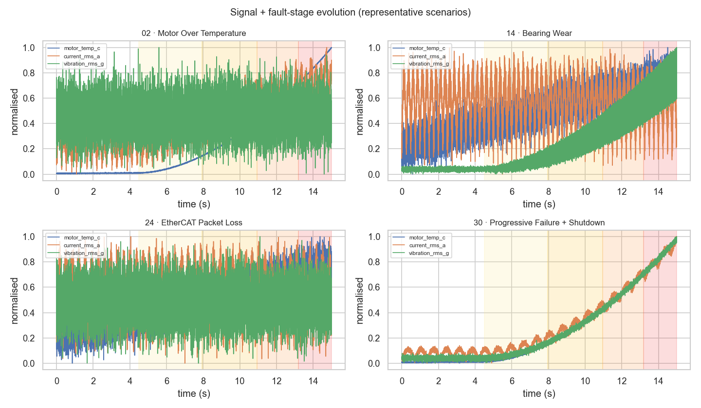
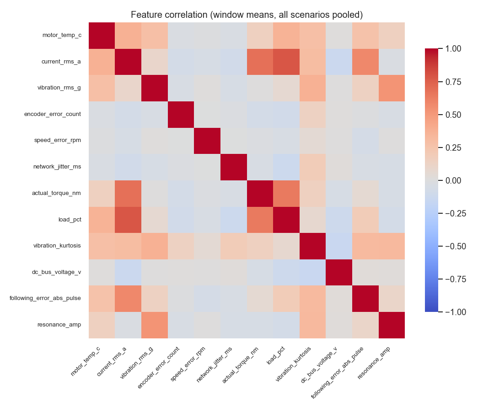
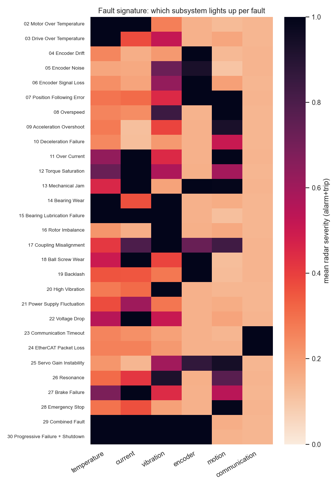
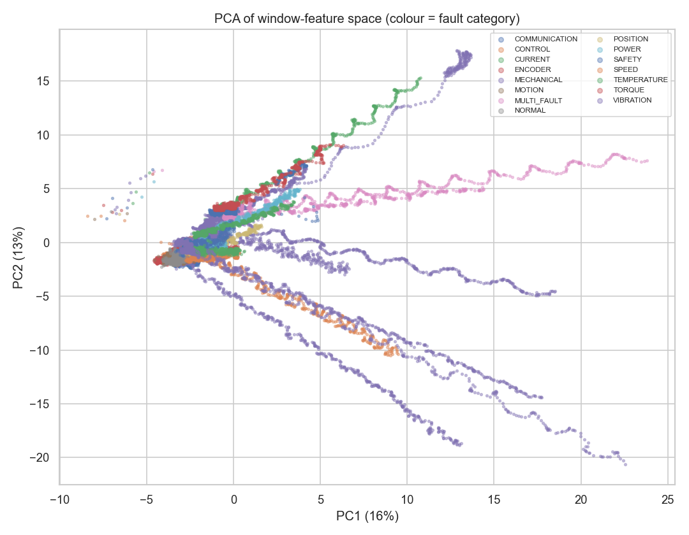
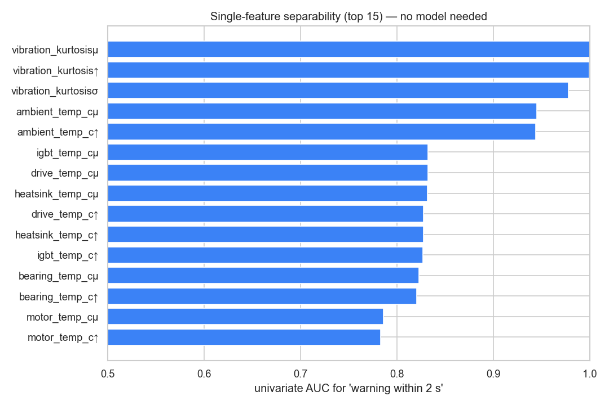
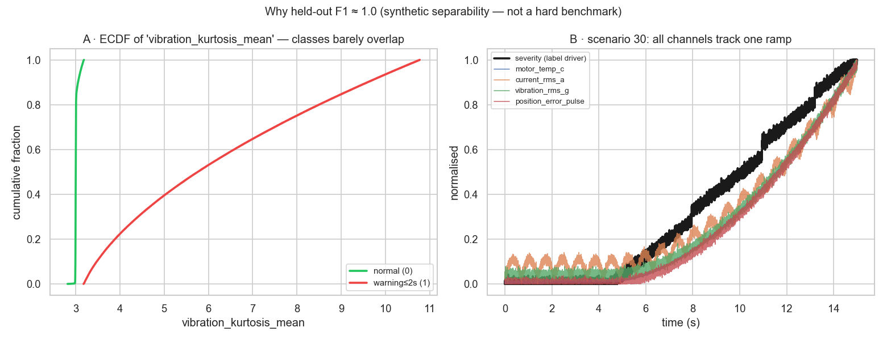

# Live Monitor v4.1 合成資料分析（EDA / 故障特徵 / 模型診斷）

> **狀態（2026-07-04）**：完成 v4.1 合成伺服資料的資料分析。從 vendored 生成器重現 30 情境
> （15 秒 @ 1000 Hz、142 欄），產出 6 張報告圖與 `outputs/metrics/monitor_v4_analysis.json`。
> 重點結論：資料**物理上合理但統計上「太好分」**——單一特徵即可把「即將告警」分到 AUC≈1.0，
> 這正是留出情境 **F1 = 0.9997**、提前量 5.0s 的來源，**非困難基準**。
>
> 相關：[`../../docs/MODULE_MONITOR_V3_PLAN.md`](../../docs/MODULE_MONITOR_V3_PLAN.md)（軌道定位/誠實性紅線）、
> [`../metrics/monitor_v4_analysis.json`](../metrics/monitor_v4_analysis.json)（本分析數據）、
> 重現腳本 `src/monitor/analyze_v4.py`。

## 0. 誠實性前提（務必先讀）

- **AI 合成資料**：`line_id=..._V4_1`、`drive_model=Mitsubishi MR-J5-G simulated`、alarm code `V4_*` 皆為模擬標籤，**非真實產線遙測**。
- **標籤是注入的**：`fault_stage / warning / alarm / trip / health / rul` 全是**單一 severity 斜坡**的確定性函數；感測欄位也是**同一條 severity + 小雜訊**。
- 本分析的價值在**如實量化這個結構**（為何好分、哪個子系統對應哪類故障），而**非宣稱難度或泛化**。Demo 軌，與真實 PHM 主線分開、不取代之。

## 1. 資料事實

| 項目 | 值 |
| --- | --- |
| 情境 / 每情境列數 / 欄數 | 30 / 15,000 / **142** |
| 模型特徵維度（滑窗 mean/std/max） | **120** |
| 缺失值 | **僅 scenario 06（Encoder Signal Loss）**在 `encoder_count` 注入 1,704 個 NaN（訊號遺失設計），其餘 0 |
| 特徵平均\|相關\| | **0.142**（見 §2） |

> 註：分析時發現並修正一個 bug——雷達 `encoder` 軸改用 `encoder_error_count` 後，scenario 06 的 by-design NaN 會經 `np.maximum` 汙染整個子系統嚴重度；已改 `np.fmax`（忽略 NaN、回退其他 encoder 欄），回放包 scenario_06 的 encoder null 由 36 → 0。

## 2. 探索式 EDA

### 2.1 訊號與故障階段演進


代表情境的正規化訊號 + 故障階段底色（黃→橙→紅 = warning→alarm→trip）。可見**故障在 30% 時點起步、severity 單調爬升**，感測通道隨之抬升；不同設備（Heavy Press / Rotary Table / EtherCAT / Predictive Demo）動力學不同但演進骨架一致。

### 2.2 特徵相關


跨情境彙整的窗均值相關矩陣。整體平均\|相關\| = **0.142**（不算高，因跨 30 種故障、各故障主導不同通道），但**同故障內**的通道高度共動（見 §4 的「同一條斜坡」）。

## 3. 故障特徵剖析

### 3.1 故障簽章：哪個子系統亮燈


29 個故障 × 6 子系統，值 = alarm+trip 窗內的平均雷達嚴重度。**物理對應高度合理**：

| 故障 | argmax 子系統 |
| --- | --- |
| 02 Motor / 03 Drive Over Temp | temperature |
| 04–06 Encoder Drift/Noise/Signal Loss | encoder |
| 11 Over Current | current |
| 20 High Vibration / 26 Resonance | vibration |
| 23 Communication Timeout | communication |
| 28 Emergency Stop | motion |
| 29 Combined / 30 Progressive | 多軸同亮（溫度領先） |

少數映到相鄰子系統（如 **14 Bearing Wear → temperature**，因軸承溫度 z-score 抬升最大；扭矩→電流）——與 [`MODULE_MONITOR_V3_PLAN.md`](../../docs/MODULE_MONITOR_V3_PLAN.md) §3 註記一致。

### 3.2 特徵空間可分性（PCA）


窗特徵標準化後前兩主成分（PC1+PC2 僅佔 **29%** 變異，故只是投影示意）。所有情境**從共同的健康簇（灰 NORMAL，左下）沿各自的故障「射線」發散**——這就是「每個故障 = 從健康出發、沿 severity 拉出的一條軌跡」的視覺證據。

## 4. 模型診斷：為何 F1 ≈ 1.0（誠實性核心）

### 4.1 單一特徵就夠分


對目標「2 秒內將 warning」，**不用模型**、單一特徵的 AUC 前 15 名：`vibration_kurtosis_mean` = **1.000**、`vibration_kurtosis_max` = 0.9998，溫度族群 0.83–0.95。共 **2 個特徵 AUC ≥ 0.999**。

> `vibration_kurtosis = 3 + 8·sev²`，在**所有**故障都隨 severity 抬升，是近乎完美的 severity 代理。schema 刻意**把它排除於雷達軸**（會汙染雷達），但**保留為模型特徵**——這就是模型輕鬆達標的直接原因。

### 4.2 標籤與通道共用同一條斜坡


- **A（ECDF）**：`vibration_kurtosis_mean` 對 normal（幾乎垂直於 ~3）與 warning（散到 11）兩類**幾乎不重疊** → 單特徵即可近完美分割。
- **B（scenario 30）**：severity（黑，標籤驅動）與 `motor_temp / current / vibration / position_error` **同形爬升**——感測即標籤、標籤即感測。

### 4.3 結論
留出整條情境評估仍得 **F1 = 0.9997、中位提前量 5.0s**（留出 = 情境 1/7/13/19/25）。這**不是**因為模型強，而是**資料結構決定**：標籤與特徵同源於一條平滑 severity 斜坡，故：

1. 指標偏高是**合成可分性**，非基準難度；
2. **再多資料也不會變難**（生成器結構不變）；
3. 本軌價值在**即時視覺、提前量流程、故障簽章的可解釋性**，而非模型難度。

## 5. 重現

```bash
python -m src.monitor.analyze_v4     # 產生 6 張圖 + outputs/metrics/monitor_v4_analysis.json
```
資料由 vendored 生成器（seed 42）重現，**無需原始 476MB 檔**。
