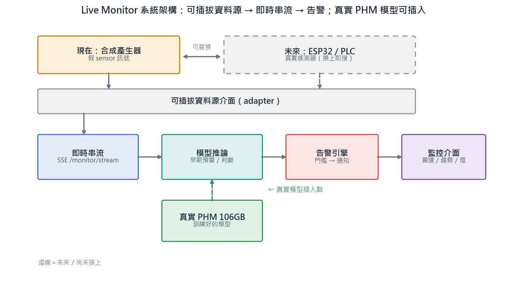

# 專案定位說明：真實建模 × 可上線系統（合成 vs 真實）

> **狀態（2026-07-04）**：全案定位 + 合成資料軌**整合報告**。全案由兩個**互補**貢獻構成：
> (1) 以**真實 PHM 資料**驗證的診斷模型（模組 Servo）；(2) 一套**可上線的即時監控/告警系統**
> （Live Monitor，以合成資料作為感測器替身）。本文件含定位、合成 vs 真實對照、**兩個合成來源
> 總覽（本軌 + 組員 repo）**、誠實性紅線、與**本軌交付物索引**（§6），供報告「定位/資料誠實性」
> 章節直接引用。
>
> 相關：[`../../docs/MODULE_SERVO_PLAN.md`](../../docs/MODULE_SERVO_PLAN.md)（真實主線）、
> [`../../docs/MODULE_MONITOR_V3_PLAN.md`](../../docs/MODULE_MONITOR_V3_PLAN.md)（即時監控軌）、
> [`MONITOR_V4_DATA_ANALYSIS.md`](MONITOR_V4_DATA_ANALYSIS.md)（合成資料為何 trivially separable 的量化證據）。

## 1. 一句話定位

> 本專案交付兩件**各司其職**的東西：**「模型會判斷」**（模組 Servo，真實 PHM 資料訓練並留出評估）
> 與**「系統能上線」**（Live Monitor，即時串流 + 告警，資料源為合成感測器替身、未來可換真實 sensor）。
> 合成資料**不用於宣稱模型成果**，而是驅動系統展示；真實資料**不用於即時花俏展示**，而是提供可信的
> 建模結論。兩者互補，不互相取代。

## 1.5 系統架構

> 資料源設計為**可插拔介面**：現在接**合成產生器**（假 sensor），未來換上 **ESP32／PLC** 真實感測器
> 而後段管線（即時串流 → 模型推論 → 告警引擎 → 監控介面）完全不變；**模組 Servo** 訓練好的真實
> 模型可插入「模型推論」階段，形成「真實模型 + 可上線部署」的完整路徑。（`.svg` 向量檔亦於同目錄）

## 2. 對照表（核心）

| 面向 | Live Monitor（合成軌） | 模組 Servo（真實主線） |
| --- | --- | --- |
| **角色** | 可上線的**即時監控/告警系統**（demo） | **真實資料驗證的診斷模型**（研究成果） |
| **資料來源** | Vendored v4.1 生成器（**AI 合成**，seed 可重現） | **PHM Society FMCRD** 伺服-滾珠螺桿退化資料集 |
| **資料性質** | 合成、標籤為注入 | 真實**公開基準**（106GB；屬**高擬真模擬**，非真實工廠 log） |
| **規模** | 30 情境 × 142 欄 × 15,000 列 | 106GB 原始 → 串流聚合 **1,465 段特徵**（train 665 / 留出 800） |
| **任務** | 即時串流 / 早期預警 / 告警視覺化 | 健康狀態分類 + 退化值(DV)回歸（**非 RUL**） |
| **指標** | 早期預警 F1 ≈ **1.00**、提前量 **5.0s** | 分類 macro-F1 **0.757**、DV **R²=0.937 / MAE=0.047**、1D-CNN F1 **0.692** |
| **指標為何如此** | **標籤洩漏**：標籤與感測同源於一條 severity 斜坡 → 單一特徵即 AUC=1.0 | **真實難度**：類別邊界（如 LN↔LO）真實混淆、資料不均 |
| **正確用途** | 系統展示 / 測試夾具 / 故障注入 / 教學 | 建模成果 / 可解釋性 / 錯誤分析 / 告警門檻設計 |
| **未來延伸** | 換上 **ESP32／PLC** 真實感測器即可上線（介面不變） | 深化 DL（頻譜/逐點 CNN）、部署進即時系統 |

## 2.5 合成資料來源總覽（本軌 + 組員）

本專案有**兩個合成資料來源**，都屬「demo / 教學 / 視覺化」類、**非建模成果**，且**踩同一個誠實性坑（標籤洩漏）**：

| 合成來源 | 產生方式 | 用途 | 誠實性 |
| --- | --- | --- | --- |
| **Live Monitor v4.1**（本軌） | vendored 產生器、30 情境 × 142 欄；標籤與感測**同源於一條 severity 斜坡** | 即時監控/告警系統 demo、視覺化、測試夾具 | 單一特徵 `vibration_kurtosis` AUC=1.0 → F1≈1.0 為**合成可分性**（見 [`MONITOR_V4_DATA_ANALYSIS.md`](MONITOR_V4_DATA_ANALYSIS.md)）|
| **Fin-servo_motor_simulator**（組員） | 物理風格**模板**、7 類故障；故障靠 `if status==...` 加偏移（如 `noise*=6`、stuck 鎖角度、overheating +27°C）| 教學 / Streamlit 儀表板 demo | 特徵由**決定標籤的變數**推出 → 類別乾淨可分、分類器準確率天生高 |

**兩者共同結論**：當即時系統/教學展示很好，當**模型 benchmark 不行**——準確率高是資料太乾淨（標籤洩漏），非模型能力。真正建模成果仍是**真實 PHM**（模組 Servo，留出 F1 0.757）。

## 3. 定位說明（報告用敘述）

本專案刻意採**雙軌**設計，因為「預測性維護」在實務上同時需要**可信的模型**與**可運作的系統**，兩者
缺一不可：

- **模組 Servo（真實主線）** 回答「模型準不準」。以 PHM Society FMCRD 真實基準資料集訓練，於**留出
  測試**得分類 macro-F1 0.757、DV 回歸 R²=0.937，並附 PyTorch 1D-CNN 離線 baseline（留出 F1 0.692，
  如實揭露 seed 敏感性）。此軌的分數**不高得誇張**，正因為資料是真實、有難度的。

- **Live Monitor（合成軌）** 回答「系統跑不跑得起來」。以可重現的 AI 生成器產生模擬伺服訊號，逐幀
  回放/即時串流成監控台：六角子系統雷達、早期預警燈、示警→告警提前量。此軌的分數**高得近乎完美
  （F1≈1.0、每次提前 5.0s）**，正因為資料是合成、trivially separable 的——這**不是模型強**，而是資料
  結構決定（見 [`MONITOR_V4_DATA_ANALYSIS.md`](MONITOR_V4_DATA_ANALYSIS.md)：單一特徵即 AUC=1.0）。

**關鍵理解**：讓合成資料「不適合訓練」的性質（乾淨、可預測、可控），正是讓它「適合做系統展示」的
性質——可隨叫隨到注入指定故障、可重現地測試整條告警管線。因此合成資料**並非無用**，而是被正確
定位為**感測器替身 + 測試夾具 + 展示道具**，不承擔「模型成果」的角色。

**兩軌如何銜接**：Live Monitor 的資料源設計為**可插拔介面**——現階段接合成產生器，未來接 ESP32／PLC
真實感測器而前端不變；模組 Servo 訓練好的真實模型亦可插入即時系統的「模型推論」階段，形成
「真實模型 + 可上線部署」的完整路徑。

## 4. 誠實性紅線（報告防禦，務必遵守）

- 合成 Live Monitor 資料為 **AI 生成**（`line_id=..._V4_1`、alarm code `V4_*` 皆為模擬標籤），
  **不得**呈現為真實產線遙測；F1≈1.0 為**合成可分性**，**非**基準難度，**加資料不會變難**。
- 模組 Servo 的 FMCRD 為**真實公開基準**、確有 106GB 原始資料且真跑過（`placeholder=false`），
  但屬**高擬真模擬**資料集，**非真實工廠伺服馬達 log**；任務為分類 + DV 回歸，**不宣稱 RUL**。
- 兩軌**分開陳述、互不冒充**：系統展示不等於模型驗證，模型分數不套用到合成軌。

## 5. 一句話收束

> 「我們清楚合成與真實的差別：**合成資料證明系統可即時運作，真實資料證明模型有判斷力。**
> 前者未來換上真實感測器即可上線，後者可插入該系統形成完整的預測性維護方案。」

## 6. 本軌交付物索引（Live Monitor / 合成資料軌）

| 交付物 | 位置 | 說明 |
| --- | --- | --- |
| **系統架構圖** | `../figures/monitor_v4/system_architecture.{png,svg}` | 可插拔資料源 → 串流 → 告警；PHM 模型插入點 |
| **v4.1 資料分析報告** | [`MONITOR_V4_DATA_ANALYSIS.md`](MONITOR_V4_DATA_ANALYSIS.md) + `../figures/monitor_v4/*.png` | EDA / 故障簽章 / 模型診斷（為何 F1≈1.0）|
| **1D-CNN 資料增強實驗** | `src/models/servo_cnn_augment.py` → `../metrics/servo_cnn_augment.json`、`cnn_augment_compare.png` | 真實 PHM、train-only、誠實負面/穩定性結果；前端 `/servo/augment_results` 面板 |
| **1D-CNN 特徵萃取動畫** | `src/models/servo_cnn_featmap.py` → `web/src/lib/cnnFeatmap.ts`、`CnnFeatureSlider.tsx` | 訓練模擬器教學動畫：卷積核滑動 + 健康度切換 + 偵測器標記 |
| **即時監控前端** | `web/src/app/monitor/`、`components/monitor/` | 即時串流（分格 6 圖 / 疊圖）+ 回放（六角雷達）|
| **工作紀錄** | [`WORK_REPORT_2026-07-04.md`](WORK_REPORT_2026-07-04.md) | 本 session 全部工作 |

> 線上：前端 Vercel `…/monitor`、後端 HF Space `icefeather/aifinalproject`（`/monitor/*`、`/servo/*`）。
